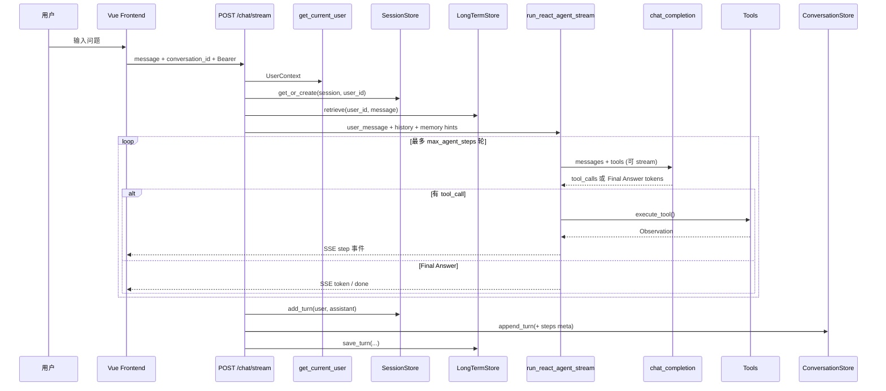
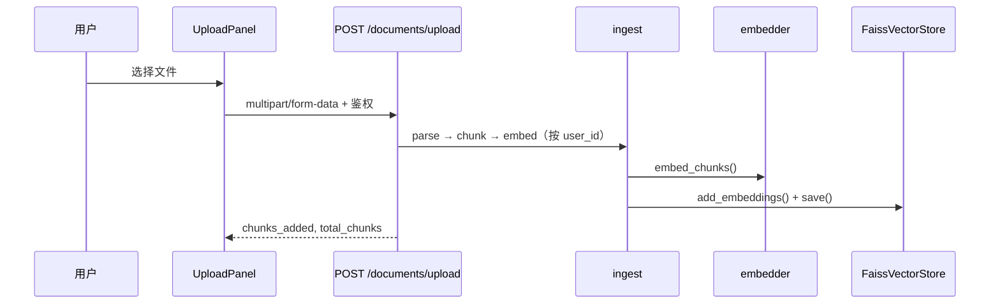

# 模块作用

> **面试约定**：以仓库真实代码为准；本文档是复习提纲，若与代码冲突以代码为准。

本项目的 **architecture（整体架构）** 文档回答一个问题：**这么多模块怎么拼在一起，用户发一条消息之后发生了什么？**

这是一个全栈 AI 助手项目，核心能力包括：

| 能力 | 作用 |
|------|------|
| ReAct Agent | 让 LLM 能「思考 → 调工具 → 看结果 → 再思考」，而不是一次性瞎编 |
| Tool Calling | 把计算器、文档检索等能力封装成 LLM 可调用的函数 |
| RAG | 基于上传文档的知识库回答，减少幻觉 |
| FAISS | 高效存储和检索文档 / 长期记忆向量 |
| Session Memory | 多轮对话短期上下文（SQLite，FIFO） |
| Long-term Memory | 跨会话抽取与检索用户偏好/事实（FAISS） |
| Conversation | SQLite 持久化会话列表与完整消息（含 steps 元数据） |
| Auth | 注册/登录、JWT / API Key、按 `user_id` 多用户隔离 |
| Eval | RAG 检索/回答/引用评分与历史查询 |
| Streaming | `POST /chat/stream` SSE 打字机 + 停止生成 |
| Frontend (Vue 3) | 聊天、上传、会话侧栏、执行可视化、记忆与评估面板 |

**主业务链路：**

1. **Agent 聊天链**：`POST /chat` 或 `POST /chat/stream` → 鉴权 → Session + 长期记忆检索 → ReAct 循环 → 可能调用 `calculator` / `search_docs` → 写回 Session + Conversation + 长期记忆
2. **RAG 链**：上传文档 → 入库 FAISS → 通过 `/rag/ask` 或 Agent 的 `search_docs` 工具检索（可触发 Eval）
3. **会话管理链**：`/conversations*` CRUD，与 `session_id` / `conversation_id` 共用同一 UUID

# 核心原理

## 分层架构

```
┌──────────────────────────────────────────────────────────┐
│  Frontend (Vue 3 + Vite)                                  │
│  ChatPage / ChatBox / ConversationSidebar / UploadPanel   │
│  ExecutionViewer / MemoryPanel / CitationPanel / AuthBar  │
└────────────────────────────┬─────────────────────────────┘
                             │ HTTP JSON / FormData / SSE
┌────────────────────────────▼─────────────────────────────┐
│  API Layer (FastAPI)                                      │
│  /auth  /chat[/stream]  /conversations  /documents        │
│  /rag/*  /memory/*  /rag/evaluations                      │
│  auth/dependencies → UserContext（多用户隔离）              │
└───────┬──────────┬──────────┬──────────┬─────────────────┘
        ▼          ▼          ▼          ▼
 SessionStore  Conversation  LongTerm   RAG / Eval
 (短期记忆)    Store(SQLite) Store      FaissVectorStore
        │          │          │          │
        └──────────┴────┬─────┴──────────┘
                        ▼
                 ReAct Agent (agent/loop.py)
                        │
                 core/llm.py (LLM + stream)
                        │
                 tools/registry.py
```

## 设计原则（本项目）

1. **LLM 层与 Agent 层分离**：`core/llm.py` 只负责发请求（含流式），ReAct 逻辑在 `agent/`
2. **工具可插拔**：新工具只需改 `tools/registry.py`，不改 Agent 循环
3. **RAG 双入口**：独立 API（`/rag/ask`）和 Agent 工具（`search_docs`）共用同一 FAISS 索引
4. **多层 Memory**：Session（短期）+ AgentMemory（单次请求）+ LongTerm（跨会话）+ Conversation（UI 持久化）
5. **按用户隔离**：文档、Session、Conversation、长期记忆、评估记录均绑定 `user_id`
6. **流式为默认交互**：聊天 UI 走 SSE；JSON `/chat` 保留兼容

# 项目中的实现方式

## 目录结构

```
agent/
├── backend/
│   ├── main.py                 # FastAPI 入口，挂载 auth/chat/conversations/…
│   ├── core/                   # config + llm + sse
│   ├── api/                    # chat, conversations, documents, rag, memory, eval
│   ├── auth/                   # JWT / API Key、UserStore、依赖注入
│   ├── agent/                  # ReAct 循环（含 stream / cancel）
│   ├── tools/                  # calculator, search_docs, list_documents
│   ├── rag/                    # 入库 + 检索 + FAISS + 文档路由
│   ├── memory/                 # Session + 长期记忆（FAISS）
│   ├── conversation/           # SQLite 会话持久化
│   ├── eval/                   # RAG 评估流水线与存储
│   ├── file_parser/            # PDF / DOCX / 图片等解析
│   └── models/schemas.py       # API 请求/响应模型
└── frontend/
    └── src/                    # Vue 3 页面与组件（*.vue）
```

## 入口文件

`backend/main.py` 创建 FastAPI 应用，注册 CORS，挂载：

| 路由模块 | 主要端点 |
|---------|---------|
| `auth/router.py` | `POST /auth/register`、`POST /auth/login` |
| `api/chat.py` | `POST /chat`、`POST /chat/stream` |
| `api/conversations.py` | `GET/POST /conversations`、详情 / 重命名 / 删除 |
| `api/documents.py` | `POST /documents/upload` 等 |
| `api/rag.py` | `POST /rag/ask`、`POST /rag/ingest` |
| `api/memory.py` | `POST /memory/ask`、概览与长期记忆 CRUD |
| `api/eval.py` | `GET /rag/evaluations`、stats、详情 |

可选：`serve_frontend=true` 时托管 `frontend/dist`（单端口 Demo）。

## 配置中心

`backend/core/config.py` 的 `Settings` 类集中管理：

- LLM：`openai_api_key`、`openai_model`、`openai_base_url`、`openai_vision_model`
- Agent：`max_agent_steps=10`
- RAG：`rag_chunk_size`、`retrieval_top_k`、`rag_store_path`、文档路由相关项
- Memory：`max_session_turns`、`memory_store_path`、`memory_top_k` 等
- Auth：`auth_secret`、`auth_disabled`（开发可关鉴权）
- Conversation：`conversations_db_path`
- 部署：`cors_origins`、`serve_frontend`

## Auth 与多用户隔离

- `auth/dependencies.get_current_user`：优先 `Authorization: Bearer <jwt>`，其次 `X-API-Key`；`auth_disabled` 时可用 `X-User-Id` / 默认 `dev-default`
- 业务 API 经 `Depends(get_current_user)` 得到 `UserContext`；Session / Conversation / RAG 索引 / 长期记忆按 `user_id` 隔离
- 前端 `AuthBar` 登录后带 Token 调 API

## Conversation 与 Session 分工

| 模块 | 职责 | 存储 |
|------|------|------|
| `memory/session_store.py` | Agent 短期上下文注入（最近 N 轮，FIFO） | SQLite（`sessions.db`） |
| `conversation/store.py` | UI 历史列表、完整消息恢复（含 steps 等 meta） | SQLite（`conversations.db`） |
| `memory/longterm_store.py` | 跨会话事实/偏好检索与入库 | 独立 FAISS |

`conversation_id` 与 `session_id` 使用同一 UUID（`api/chat.py` 中 `conversation_id` 优先）。

## Agent 与 RAG 如何协作

用户问「员工手册里报销流程是什么？」时：

1. 鉴权通过后加载 Session 历史，并按需检索长期记忆注入 Prompt
2. ReAct Agent 的 Planner 调用 LLM，LLM 选择 `search_docs` 工具
3. `search_docs` 内部调用 `rag/retriever.py` → FAISS 检索（按用户隔离）
4. 检索结果作为 Observation 回到 Agent 循环
5. 下一轮 Planner 基于 Observation 生成 Final Answer
6. 写回 Session、Conversation，并尝试抽取长期记忆

**注意**：Agent 路径下 LLM 自己组织答案；`/rag/ask` 路径下由 `rag/chain.py` 固定 Prompt 模板生成答案。两者 Prompt 策略不同。

## Agent 可视化现状

- 后端 `ChatResponse.steps` / SSE `step` 事件返回完整 ReAct trace
- 前端 `ChatPage.vue` 侧栏 `ExecutionViewer`、`CitationPanel`、`MemoryPanel`、`DebugInspector` 展示执行与引用
- 详见 [frontend.md](./frontend.md)

## 流式输出与停止生成

- 聊天 UI 默认走 `POST /chat/stream`（SSE），逐 token 展示 Final Answer，并可推送 `step` 等事件
- 生成中 InputBox 显示「停止生成」，前端 `AbortController` + 后端 `Request.is_disconnected()` / `AgentCancelledError` 全链路取消
- 原 `POST /chat` JSON 接口保留兼容
- 详见 [streaming.md](./streaming.md)、[stop-generation.md](./stop-generation.md)

## Eval（RAG 评估）

- `eval/pipeline.py` 对检索质量、回答、引用做评分并持久化
- API：`GET /rag/evaluations`、`/stats`、`/{id}`（按用户过滤）
- 前端可有评估面板查看历史与统计

# 数据流

## 流程 1：用户聊天（ReAct Agent，含流式）



## 流程 2：文档入库 + RAG 检索



## 流程 3：独立 RAG 问答

```
POST /rag/ask
  → 鉴权
  → SessionStore 加载历史
  → rag_ask(): embed → FAISS search → build_rag_messages → LLM
  → 可选 Eval 流水线落库
  → SessionStore 保存本轮
  → 返回 answer + sources
```

# 面试题

> 每题提供两版回答：**30 秒版**适合开场快速应答，**2 分钟版**适合面试官追问「展开讲讲」。
> 口述时优先对齐当前代码路径；文档数字与默认值若有出入，以 `config.py` / 源码为准。

## 请用 1 分钟介绍你这个 Agent 项目的整体架构

### 简短回答（30秒版）

这是一个 Vue 3 前端 + FastAPI 后端的多用户 AI 助手。用户可聊天、上传文档建知识库、管理会话。后端核心是 ReAct Agent：LLM 思考后调工具（计算器、文档检索），把结果作为 Observation 再推理。另有 Session / 长期记忆 / SQLite 会话持久化，聊天默认走 SSE 流式并可停止生成。

### 深入回答（2分钟版）

前端 Vue 3（Vite）提供 `ChatPage`、会话侧栏、上传与执行可视化，默认调 `POST /chat/stream`。请求先过 `auth/dependencies` 得到 `user_id`。`SessionStore` 注入短期历史，`LongTermStore` 检索跨会话记忆，再进入 `run_react_agent` / `_stream`：`core/llm.py` 发请求，`tools/registry` 执行 calculator 或 search_docs，SSE 推送 step 与 token。结束后写 Session、`ConversationStore`（SQLite）并尝试长期记忆入库。PDF 等文档走 ingest → Embedding → 用户隔离的 `FaissVectorStore`；`/rag/ask` 是固定 RAG 链，并可走 Eval。

## ReAct 和 Chain-of-Thought（CoT）有什么区别？

### 简短回答（30秒版）

CoT 让模型「一步步想」，输出仍是纯文本，无法接触外部世界。ReAct 在 Thought 之后还能 Action——调工具、查库、检索文档，把 Observation 喂回模型继续推理。CoT 是「想」；ReAct 是「想 + 做 + 再看结果」。

### 深入回答（2分钟版）

CoT 只在 Prompt 里引导链式推理，模型不能改变环境。ReAct 在 `agent/loop.py` 实现完整循环：Planner 调 LLM 输出 Thought/Action，Executor 经 `tools/registry.py` 执行工具，Observation 追加到 messages 进入下一轮。Thought 是 CoT 的体现，但 ReAct 多了与 FAISS、计算器等真实系统的交互闭环，适合「先查文档再算数」这类多步任务。流式版在循环中推送 step / token，并支持取消。

## 你的项目里 RAG 和 Agent 是什么关系？为什么要有两条入口？

### 简短回答（30秒版）

RAG 解决「知识从哪来」，Agent 解决「怎么一步步完成任务」。本项目把检索封装成 `search_docs` 工具，Agent 自主决定何时查文档；同时提供 `/rag/ask` 固定 RAG 问答 API，不经过 ReAct。两条入口共用同一 FAISS 索引，但 Prompt 策略不同。

### 深入回答（2分钟版）

Agent 路径下 LLM 在 ReAct 循环里自主选择是否调用 `search_docs`，检索结果作为 Observation 后由模型组织答案。`/rag/ask` 走 `rag/chain.py` 固定模板：embed → FAISS Top-K → 拼 Prompt → LLM，强制「仅根据资料回答」并返回 sources，还可挂 Eval。双入口是为兼顾灵活推理与可控文档 QA：前者适合开放域 + 计算器 + 多步决策，后者适合纯知识库问答、低延迟、可审计来源。

## Session / Agent / Long-term / Conversation 分别存什么？

### 简短回答（30秒版）

Session：跨请求短期 user/assistant，SQLite 持久化、默认约 10 轮 FIFO。AgentMemory：单次 ReAct 全量 messages + trace，请求结束销毁。Long-term：跨会话抽取的事实偏好，FAISS。Conversation：另一套 SQLite，给 UI 完整历史（含 steps meta），刷新可恢复。

### 深入回答（2分钟版）

`SessionStore`（`data/sessions.db`）按 `user_id` + session 存 FIFO 对话，供 Agent Prompt，重启不丢短期上下文。`AgentMemory` 只服务当次循环与可观测 steps。`LongTermStore` 在聊天前后 retrieve / save_turn，与 RAG 文档库路径分离（`memory_store_path`）。`ConversationStore`（`conversations.db`）与 session 同 UUID，负责侧栏列表与完整消息/meta 恢复——与 Session 职责分离：一个喂模型，一个喂 UI。

## 如果 LLM 提供商从 OpenAI 换成智谱，需要改哪些代码？

### 简短回答（30秒版）

主要改 `.env`：`OPENAI_API_KEY`、`OPENAI_BASE_URL`（智谱兼容端点）、`OPENAI_MODEL`、`EMBEDDING_MODEL`。`core/llm.py` 用 OpenAI SDK 兼容模式，Agent/RAG 层通常不用动。若新模型不支持 Function Calling，需加强 `agent/parser.py` 的文本 fallback。

### 深入回答（2分钟版）

配置集中在 `core/config.py` 的 Settings。换提供商时改环境变量即可，业务代码经 `chat_completion` / stream 和 embedder 统一出口。注意 Embedding 维度变化需重建 FAISS（文档库与记忆库都可能受影响）；若 tool calling 格式有差异，改动点收敛在 `core/llm.py` 和 `agent/parser.py`，ReAct 循环与各 Store 无需重构。

## 为什么 Tool Calling 要单独做成 registry，而不是写在 Agent 循环里？

### 简短回答（30秒版）

开闭原则：新增工具只改 `tools/registry.py` 注册 schema 和 handler，Agent 循环代码保持稳定。`agent/planner.py` 通过 `get_tool_schemas()` 自动拿到全部工具，循环只负责「调 LLM → 执行 → 观察」，不关心具体工具有几个。

### 深入回答（2分钟版）

registry 把工具定义（OpenAI function schema）与执行逻辑（handler）解耦。`agent/loop.py` 只调用 `execute_tool(name, args)`，Planner 用 `get_tool_schemas()` 注入 LLM。加 weather 工具只需：写 handler、写 schema、`registry.py` 注册——不改 ReAct 循环。这也便于测试：可 mock registry 单独测 Agent 逻辑，或单独测 search_docs 与 FAISS 的集成。

## 上传文档后，向量和原文分别存在哪里？

### 简短回答（30秒版）

向量存在用户对应的 FAISS 索引（`rag_store_path` 下由 FaissVectorStore 管理）。chunk 原文、来源、页码等元数据在配套 metadata。检索时 FAISS 返回 ID，再查 metadata 取文本拼进 Prompt。

### 深入回答（2分钟版）

上传走 `POST /documents/upload` → `file_parser` 解析 → chunk → `embedder` → `FaissVectorStore.add_embeddings()` 并 `save()`，且与 `user_id` 隔离。FAISS 存向量做相似度；原文在 metadata。Agent 的 `search_docs` 和 `/rag/ask` 共用同一套存储，保证入库一次、双入口一致。

## 前端刷新页面后，对话历史还在吗？为什么？

### 简短回答（30秒版）

对话文本通常还在：前端保留 conversation/session id；`ConversationStore` 拉回气泡与 steps meta，`SessionStore`（同为 SQLite）仍可给 Agent 注入近期 history。长期记忆在独立 FAISS。跨用户访问 403。

### 深入回答（2分钟版）

`ConversationSidebar` 调 `/conversations`；ChatBox 可 `restoreMessages`。Session 与 Conversation 都落盘，但职责不同（Prompt vs UI）。短板在多副本：两套 SQLite + 本地 FAISS 不适合水平扩展，生产可迁共享 DB / Redis / 向量库。

## 你的 Agent 最多跑几轮？超过会怎样？

### 简短回答（30秒版）

`config.py` 中 `max_agent_steps`（默认 10），每轮对应一次 Thought → Action → Observation。超过仍未产出 Final Answer 会失败并返回错误（如 503）。目的是防止无限调工具导致延迟和成本失控。

### 深入回答（2分钟版）

ReAct 循环在 `agent/loop.py` 用步数上限约束。每轮 Planner 调 LLM，有 tool_calls 则执行并写 Observation，否则解析 Final Answer。超限 fail-fast；流式路径还可因客户端 abort 抛 `AgentCancelledError`。调优按任务改配置；响应里的 steps 便于调试边界 case。

## 流式输出和停止生成是怎么做的？

### 简短回答（30秒版）

`core/llm.py` 支持流式补全；`api/chat.py` 的 `/chat/stream` 用 SSE（`core/sse.py`）推 token 与 step。前端 `AbortController` 断开连接，后端感知 disconnect / 取消标志，中断 Agent 循环，避免继续烧 token。

### 深入回答（2分钟版）

五层大致是：LLM stream → Agent `run_react_agent_stream` 边跑边 yield 事件 → API `StreamingResponse` → 前端 SSE 解析 → 气泡打字机。停止时 InputBox 触发 abort；服务端 `is_disconnected` 与 `AgentCancelledError` 保证工具循环尽快退出。Session / Conversation 写入时机在流正常结束之后，避免半截对话入库。详见 streaming / stop-generation 文档。

## 多用户鉴权是怎么做的？数据如何隔离？

### 简短回答（30秒版）

`/auth/register|login` 发 JWT（也支持 API Key）。业务路由 `Depends(get_current_user)`。文档向量、Session、Conversation、长期记忆、Eval 记录都带 `user_id`，跨用户访问返回 403。

### 深入回答（2分钟版）

`auth/user_store` 管用户与密码哈希 / api_key；`jwt_utils` 签发校验。开发可 `auth_disabled` 用默认用户方便本地调试。隔离是产品级要点：RAG 索引与记忆库不能串数据。面试可对比「仅 session_id 无用户」的早期 MVP 与当前方案。

## `/chat` 和 `/rag/ask` 分别适合什么场景？

### 简短回答（30秒版）

`/chat`（及 stream）适合开放域、要工具或多步推理、Agent 自主决定是否查文档。`/rag/ask` 适合纯文档 QA：固定 Prompt、强制依据资料、返回 sources，行为更可预期，并便于 Eval。

### 深入回答（2分钟版）

`/chat` 走 ReAct + Session + 可选长期记忆 + search_docs / calculator。`/rag/ask` 走固定链，Session 仅多轮上下文，不做 tool 决策，适合知识库门户与合规引用。共用用户隔离的 FaissVectorStore，文档入库一次即可。

## 生产环境部署时，当前架构还有哪些短板？

### 简短回答（30秒版）

Session/Conversation 已是 SQLite，但仍是单机文件；本地 FAISS 不利于多副本；默认 CORS/`auth_disabled` 不适合公网裸奔；缺系统级 rate limit 与完整可观测性。鉴权、持久化、流式、Eval 已比早期 MVP 进一步，但仍偏 Demo/实习项目量级。

### 深入回答（2分钟版）

可改进：共享 DB / Redis、向量库迁 Milvus/Qdrant、强制鉴权与限流、Embedding/LLM 熔断重试、OpenTelemetry 追踪每步 ReAct 与 token。Docker 单端口 `serve_frontend` 适合演示；水平扩展需拆状态。面试强调「已知边界 + 演进路径」比假装已生产就绪更加分。

# 容易踩坑的问题

1. **混淆多种 Memory**：Session ≠ Conversation ≠ Long-term ≠ AgentMemory，生命周期与用途不同。
2. **以为上传后 Agent 自动知道**：须入库成功且 Agent 调用 `search_docs`；空库会提示。
3. **config 与 ingest**：以当前 `ingest` / chunker 是否读取 `rag_chunk_size` 为准，勿死记旧文档数字。
4. **Embedding 模型与索引维度**：换模型后文档库与记忆库都可能要重建。
5. **前端有 conversation id、Session 已空**：服务重启后短期记忆丢，但 SQLite 仍可能恢复 UI；下一轮 Agent 上下文可能变薄。
6. **文档写 React**：前端是 Vue 3（`frontend/package.json` + `*.vue`），面试勿说错栈。

# 进阶知识

- **Multi-Agent 编排**：Supervisor + 专业子 Agent（检索 Agent、计算 Agent）
- **MCP（Model Context Protocol）**：标准化外部工具接入
- **Hybrid Search**：BM25 + 向量混合检索，提升关键词命中
- **Reranker**：检索后再用 cross-encoder 重排序
- **可观测性**：OpenTelemetry 追踪每步 ReAct 延迟与 token 消耗
- **部署**：Docker + Redis Session + 向量库迁移到 Milvus/Qdrant + 强制鉴权

**相关文档**：[backend.md](./backend.md) · [react-agent.md](./react-agent.md) · [rag.md](./rag.md) · [memory.md](./memory.md) · [frontend.md](./frontend.md) · [streaming.md](./streaming.md) · [stop-generation.md](./stop-generation.md)
