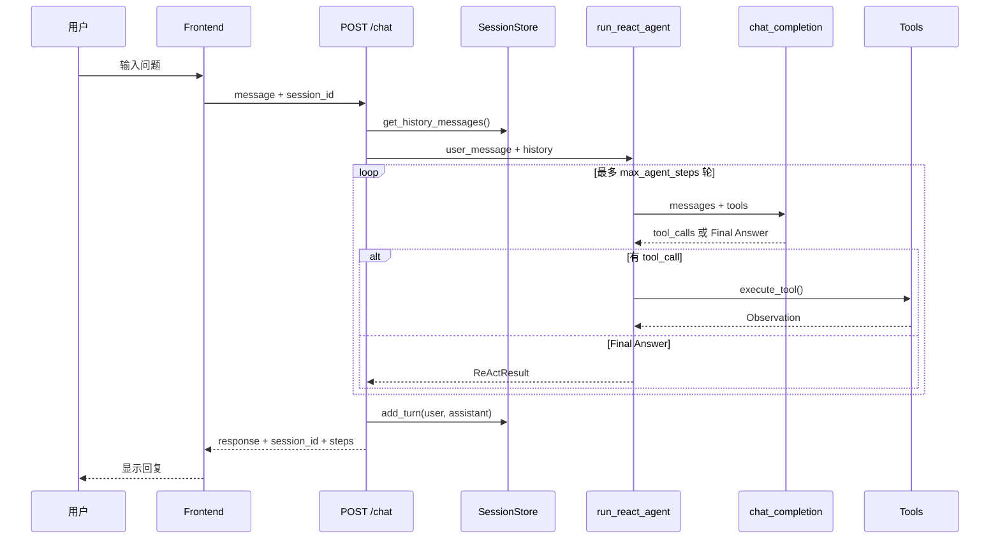
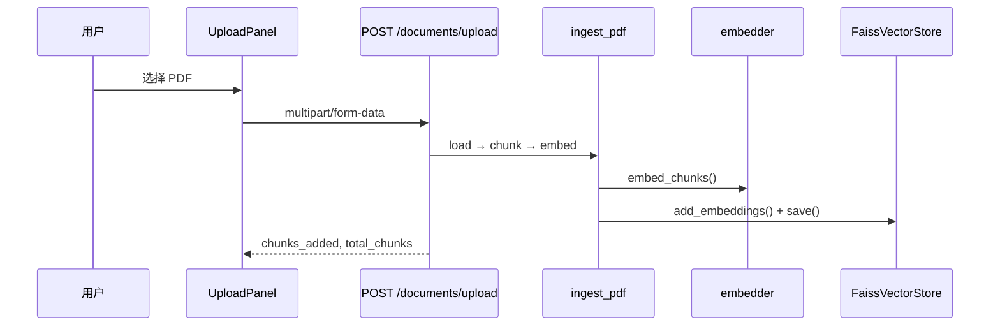

# 模块作用

本项目的 **architecture（整体架构）** 文档回答一个问题：**这么多模块怎么拼在一起，用户发一条消息之后发生了什么？**

这是一个全栈 AI 助手项目，核心能力包括：

| 能力 | 作用 |
|------|------|
| ReAct Agent | 让 LLM 能「思考 → 调工具 → 看结果 → 再思考」，而不是一次性瞎编 |
| Tool Calling | 把计算器、文档检索等能力封装成 LLM 可调用的函数 |
| RAG | 基于上传的 PDF 知识库回答，减少幻觉 |
| FAISS | 高效存储和检索文档向量 |
| Memory | 多轮对话记住上下文 |
| Frontend | 聊天界面 + PDF 上传 +（预留）Agent 执行可视化 |

**两条主业务链路：**

1. **Agent 聊天链**：`POST /chat` → Session 历史 → ReAct 循环 → 可能调用 `calculator` / `search_docs`
2. **RAG 链**：上传 PDF → 入库 FAISS → 通过 `/rag/ask` 或 Agent 的 `search_docs` 工具检索

# 核心原理

## 分层架构

```
┌─────────────────────────────────────────┐
│  Frontend (React)                        │
│  ChatBox / UploadPanel / 预留 Sidebar    │
└──────────────────┬──────────────────────┘
                   │ HTTP (JSON / FormData)
┌──────────────────▼──────────────────────┐
│  API Layer (FastAPI)                     │
│  /chat  /documents/upload  /rag/*        │
└──────────────────┬──────────────────────┘
                   │
     ┌─────────────┼─────────────┐
     ▼             ▼             ▼
 SessionStore   ReAct Agent    RAG Chain
     │             │             │
     │        Planner/Executor   │
     │             │             │
     └─────────────┼─────────────┘
                   ▼
            core/llm.py (LLM)
                   │
            tools/registry.py
                   │
            rag/* + FaissVectorStore
```

## 设计原则（本项目）

1. **LLM 层与 Agent 层分离**：`core/llm.py` 只负责发请求，ReAct 逻辑在 `agent/`
2. **工具可插拔**：新工具只需改 `tools/registry.py`，不改 Agent 循环
3. **RAG 双入口**：独立 API（`/rag/ask`）和 Agent 工具（`search_docs`）共用同一 FAISS 索引
4. **双 Memory 模型**：跨请求的 Session 记忆 vs 单次请求的 Agent 工作记忆

# 项目中的实现方式

## 目录结构

```
agent/
├── backend/
│   ├── main.py              # FastAPI 入口，挂载 3 组路由
│   ├── core/                # config + llm
│   ├── api/                 # chat, documents, rag
│   ├── agent/               # ReAct 循环
│   ├── tools/               # calculator, search_docs
│   ├── rag/                 # 入库 + 检索 + FAISS
│   ├── memory/              # Session 短期记忆
│   └── models/schemas.py    # API 请求/响应模型
└── frontend/
    └── src/                 # React 页面与组件
```

## 入口文件

`backend/main.py` 创建 FastAPI 应用，注册 CORS，挂载：

- `api/chat.py` → `POST /chat`
- `api/documents.py` → `POST /documents/upload`
- `api/rag.py` → `POST /rag/ask`、`POST /rag/ingest`

## 配置中心

`backend/core/config.py` 的 `Settings` 类集中管理：

- LLM：`openai_api_key`、`openai_model`、`openai_base_url`（默认兼容智谱 GLM）
- Agent：`max_agent_steps=10`
- RAG：`rag_chunk_size`、`retrieval_top_k`、`rag_store_path`
- Memory：`max_session_turns=10`

## Agent 与 RAG 如何协作

用户问「员工手册里报销流程是什么？」时：

1. ReAct Agent 的 Planner 调用 LLM，LLM 选择 `search_docs` 工具
2. `search_docs` 内部调用 `rag/retriever.py` → FAISS 检索
3. 检索结果作为 Observation 回到 Agent 循环
4. 下一轮 Planner 基于 Observation 生成 Final Answer

**注意**：Agent 路径下 LLM 自己组织答案；`/rag/ask` 路径下由 `rag/chain.py` 固定 Prompt 模板生成答案。两者 Prompt 策略不同。

## Agent 可视化现状

- 后端 `ChatResponse.steps` 已返回完整 ReAct trace
- 前端 `ChatPage.jsx` 侧边栏通过 `ExecutionViewer` 实时展示 steps（流式 `step` 事件）
- 详见 [frontend.md](./frontend.md)

## 流式输出与停止生成

- 聊天 UI 默认走 `POST /chat/stream`（SSE），逐 token 展示 Final Answer
- 生成中 InputBox 显示「停止生成」，前端 `AbortController` + 后端 `is_disconnected()` 全链路取消
- 原 `POST /chat` JSON 接口保留兼容
- 详见 [stop-generation.md](./stop-generation.md)

# 数据流

## 流程 1：用户聊天（ReAct Agent）



## 流程 2：PDF 入库 + RAG 检索



## 流程 3：独立 RAG 问答

```
POST /rag/ask
  → SessionStore 加载历史
  → rag_ask(): embed → FAISS search → build_rag_messages → LLM
  → SessionStore 保存本轮
  → 返回 answer + sources
```

# 面试题

> 每题提供两版回答：**30 秒版**适合开场快速应答，**2 分钟版**适合面试官追问「展开讲讲」。

## 请用 1 分钟介绍你这个 Agent 项目的整体架构

### 简短回答（30秒版）

这是一个 React 前端 + FastAPI 后端的 AI 助手。用户可聊天或上传 PDF 建知识库。后端核心是 ReAct Agent：LLM 思考后调工具（计算器、文档检索），把结果作为 Observation 再推理，直到给出最终答案。RAG 负责 PDF 切块、Embedding 和 FAISS 检索；SessionStore 负责多轮对话记忆。

### 深入回答（2分钟版）

前端 React 提供 ChatBox 和 UploadPanel，通过 HTTP 调后端三条主链路。`POST /chat` 走 ReAct：`SessionStore` 取历史 → `run_react_agent` 循环 → `core/llm.py` 发请求 → `tools/registry.py` 执行 calculator 或 search_docs → 返回 response 和 steps trace。PDF 上传走 ingest：切 chunk、Embedding、写入 `FaissVectorStore`。跨请求记忆在 `SessionStore`（默认 10 轮 FIFO）；单次请求内的 tool 消息和 ReAct trace 在 `AgentMemory`，请求结束即销毁。

## ReAct 和 Chain-of-Thought（CoT）有什么区别？

### 简短回答（30秒版）

CoT 让模型「一步步想」，输出仍是纯文本，无法接触外部世界。ReAct 在 Thought 之后还能 Action——调工具、查库、检索文档，把 Observation 喂回模型继续推理。CoT 是「想」；ReAct 是「想 + 做 + 再看结果」。

### 深入回答（2分钟版）

CoT 只在 Prompt 里引导链式推理，模型不能改变环境。ReAct 在 `agent/loop.py` 实现完整循环：Planner 调 LLM 输出 Thought/Action，Executor 经 `tools/registry.py` 执行工具，Observation 追加到 messages 进入下一轮。Thought 是 CoT 的体现，但 ReAct 多了与 FAISS、计算器等真实系统的交互闭环，适合「先查文档再算数」这类多步任务。

## 你的项目里 RAG 和 Agent 是什么关系？为什么要有两条入口？

### 简短回答（30秒版）

RAG 解决「知识从哪来」，Agent 解决「怎么一步步完成任务」。本项目把检索封装成 `search_docs` 工具，Agent 自主决定何时查文档；同时提供 `/rag/ask` 固定 RAG 问答 API，不经过 ReAct。两条入口共用同一 FAISS 索引，但 Prompt 策略不同。

### 深入回答（2分钟版）

Agent 路径下 LLM 在 ReAct 循环里自主选择是否调用 `search_docs`，检索结果作为 Observation 后由模型组织答案。`/rag/ask` 走 `rag/chain.py` 固定模板：embed → FAISS Top-K → 拼 Prompt → LLM，强制「仅根据资料回答」并返回 sources。双入口是为兼顾灵活推理与可控文档 QA：前者适合开放域 + 计算器 + 多步决策，后者适合纯知识库问答、低延迟、可审计来源。

## Session Memory 和 Agent Memory 分别存什么？生命周期有何不同？

### 简短回答（30秒版）

Session Memory 跨请求持久化 user/assistant 干净对话，默认保留 10 轮。Agent Memory 只在单次 `/chat` 请求内存在，存完整 messages（含 tool 消息）和 ReAct trace。前者生命周期跟 session_id 走；后者请求结束即销毁，trace 通过 API 返回前端。

### 深入回答（2分钟版）

`memory/session_store.py` 的 SessionStore 用进程内 dict，按 session_id 存最近 `max_session_turns=10` 轮 FIFO 对话，供 `/chat` 和 `/rag/ask` 加载上下文。`agent/memory.py` 的 AgentMemory 在单次 ReAct 运行中累积 system/user/assistant/tool 全量 messages 及每步 trace，不跨请求、不存中间 Thought 到 Session。设计意图：Session 给用户体验连续对话；AgentMemory 给单次推理完整上下文和可观测 steps。

## 如果 LLM 提供商从 OpenAI 换成智谱，需要改哪些代码？

### 简短回答（30秒版）

主要改 `.env`：`OPENAI_API_KEY`、`OPENAI_BASE_URL`（智谱兼容端点）、`OPENAI_MODEL`、`EMBEDDING_MODEL`。`core/llm.py` 用 OpenAI SDK 兼容模式，Agent/RAG 层通常不用动。若新模型不支持 Function Calling，需加强 `agent/parser.py` 的文本 fallback。

### 深入回答（2分钟版）

配置集中在 `core/config.py` 的 Settings：`openai_base_url` 默认已兼容智谱 GLM，Embedding 默认 `embedding-3`。换提供商时改环境变量即可，业务代码经 `chat_completion` 和 embedder 统一出口。注意 Embedding 维度变化需重建 FAISS 索引；若智谱 tool calling 格式有差异，改动点收敛在 `core/llm.py` 和 `agent/parser.py`，ReAct 循环、SessionStore、FaissVectorStore 无需重构。

## 为什么 Tool Calling 要单独做成 registry，而不是写在 Agent 循环里？

### 简短回答（30秒版）

开闭原则：新增工具只改 `tools/registry.py` 注册 schema 和 handler，Agent 循环代码保持稳定。`agent/planner.py` 通过 `get_tool_schemas()` 自动拿到全部工具，循环只负责「调 LLM → 执行 → 观察」，不关心具体工具有几个。

### 深入回答（2分钟版）

registry 把工具定义（OpenAI function schema）与执行逻辑（handler）解耦。`agent/loop.py` 只调用 `execute_tool(name, args)`，Planner 用 `get_tool_schemas()` 注入 LLM。加 weather 工具只需：写 handler、写 schema、`registry.py` 注册——不改 ReAct 循环。这也便于测试：可 mock registry 单独测 Agent 逻辑，或单独测 search_docs 与 FAISS 的集成。

## 上传 PDF 后，向量和原文分别存在哪里？

### 简短回答（30秒版）

向量存在 `rag/store/faiss.index`，由 FaissVectorStore 管理。chunk 原文、来源文件名、页码等元数据存在 `rag/store/metadata.json`。检索时 FAISS 返回向量 ID，再用 ID 查 metadata 取文本拼进 Prompt。

### 深入回答（2分钟版）

上传走 `POST /documents/upload` → `ingest_pdf`：PDF 加载、chunker 切分、`embedder` 生成向量 → `FaissVectorStore.add_embeddings()` 写入索引并 `save()`。FAISS IndexFlatIP 只存高维向量用于相似度搜索；原文不放进索引，而是与 chunk_id 一一对应写入 metadata.json。Agent 的 `search_docs` 和 `/rag/ask` 共用同一路径 `rag_store_path` 下的这套存储，保证入库一次、双入口检索一致。

## 前端刷新页面后，对话历史还在吗？为什么？

### 简短回答（30秒版）

可能还在，也可能不在。前端把 `session_id` 存 localStorage，刷新后会带给后端；后端 SessionStore 是进程内内存，只要服务没重启，同一 session_id 能恢复最近 10 轮。服务重启后 dict 清空，前端 ID 还在但后端无数据，表现为「失忆」。

### 深入回答（2分钟版）

React 前端刷新不丢 session_id（localStorage），`POST /chat` 携带该 ID 时 SessionStore 能命中历史。但这是 MVP 方案：无 Redis/SQLite 持久化，多实例部署时 Session 不共享，重启即丢。AgentMemory 更不可能跨刷新保留——它随单次请求销毁。生产应把 SessionStore 迁到 Redis，并考虑 TTL 与 session 过期策略；前端 steps 可视化尚未落地，刷新后只能看到对话文本而非 ReAct trace。

## 你的 Agent 最多跑几轮？超过会怎样？

### 简短回答（30秒版）

`config.py` 中 `max_agent_steps=10`，每轮对应一次 Thought → Action → Observation。超过 10 轮仍未产出 Final Answer 会抛 `ValueError`，API 返回 503。目的是防止 LLM 无限调工具导致延迟和成本失控。

### 深入回答（2分钟版）

ReAct 循环在 `agent/loop.py` 用 `for step in range(max_agent_steps)` 约束。每轮 Planner 调 LLM，若有 tool_calls 则 Executor 执行并写 Observation，否则解析 Final Answer 结束。超限且无 Final Answer 时主动 fail-fast，避免 silent hang。调优时可按任务复杂度改配置；也可在响应里返回已执行的 steps 便于调试「差一步就成功」的边界 case。

## 如果要加「流式输出」，你会改架构的哪一层？

### 简短回答（30秒版）

主要改 API 层和 LLM 层：`core/llm.py` 的 `chat_completion` 支持 stream，`api/chat.py` 用 SSE 或 WebSocket 推 token 给 React 前端。Agent 循环较复杂，可先流式 Final Answer，或逐步推送每步 ReAct trace。

### 深入回答（2分钟版）

LLM 层增加 `chat_completion_stream`，返回 async generator。FastAPI 路由从 JSON 响应改为 `StreamingResponse`（SSE）或 WebSocket。ReAct 路径有两种策略：简单版——循环仍同步跑完，仅最后一轮 Final Answer 流式输出；完整版——每步 Observation 后推送 trace 事件，前端 ChatBox 实时渲染。RAG 的 `/rag/ask` 流式改动更小，因无多轮 tool 交互。SessionStore 写入时机需后移到流结束，避免半截对话入库。

## 生产环境部署时，当前架构有哪些明显短板？

### 简短回答（30秒版）

Session 进程内存储、重启即丢；CORS 全开、无鉴权、无 rate limit。FAISS IndexFlatIP 不适合大规模向量；部分 config（如 rag_chunk_size）未完全 wired 到 ingest。前端未展示 ReAct steps，可观测性不足。

### 深入回答（2分钟版）

明显短板：SessionStore 单进程 dict 无法水平扩展和故障恢复；无用户认证与 API 限流；Embedding/LLM 调用无熔断与重试策略；FAISS 本地文件不利于多副本一致；ingest 与 config  chunk 参数不一致可能引发运维困惑。缺少 OpenTelemetry 追踪每步 ReAct 延迟与 token 消耗。改进方向：Redis Session、Milvus/Qdrant 向量库、Docker 部署、鉴权中间件，以及前端渲染 `ChatResponse.steps` 侧边栏。

## `/chat` 和 `/rag/ask` 分别适合什么场景？

### 简短回答（30秒版）

`/chat` 适合开放域对话、需要计算器或多步推理、由 Agent 自主决定是否查文档的场景。`/rag/ask` 适合纯文档 QA：固定 RAG Prompt、强制依据资料回答、返回结构化 sources，延迟更低、行为更可预期。

### 深入回答（2分钟版）

`/chat` 走 ReAct + SessionStore + 可选 search_docs：用户问「报销流程是什么再帮我算总额」时，Agent 可先检索 FAISS 再调 calculator。`/rag/ask` 走 `rag_ask` 固定链，Session 仅用于多轮上下文，不做 tool 决策，适合企业知识库门户、合规场景（答案必须带引用）。选型：要工具编排用 `/chat`；要可控、可审计的文档问答用 `/rag/ask`；两者共用 FaissVectorStore，PDF 入库一次即可。

# 容易踩坑的问题

1. **混淆两种 Memory**：Session 不存 ReAct 中间步骤；AgentMemory 不跨请求持久化。
2. **以为上传 PDF 后 Agent 自动知道**：必须入库成功且 Agent 选择调用 `search_docs`；向量库为空会返回提示。
3. **config 与 ingest 不一致**：`rag_chunk_size` 在 config 有定义，但 `ingest.py` 目前用 chunker 默认值 500/50。
4. **Embedding 模型与索引维度**：换 embedding 模型后旧索引维度不匹配，需重建索引。
5. **session_id 恢复了但后端没数据**：前端 localStorage 有 ID，后端重启后 dict 清空，表现像「失忆」。

# 进阶知识

- **Multi-Agent 编排**：Supervisor + 专业子 Agent（检索 Agent、计算 Agent）
- **MCP（Model Context Protocol）**：标准化外部工具接入
- **Hybrid Search**：BM25 + 向量混合检索，提升关键词命中
- **Reranker**：检索后再用 cross-encoder 重排序
- **可观测性**：OpenTelemetry 追踪每步 ReAct 延迟与 token 消耗
- **部署**：Docker + Redis Session + 向量库迁移到 Milvus/Qdrant

**相关文档**：[backend.md](./backend.md) · [react-agent.md](./react-agent.md) · [rag.md](./rag.md) · [memory.md](./memory.md)
