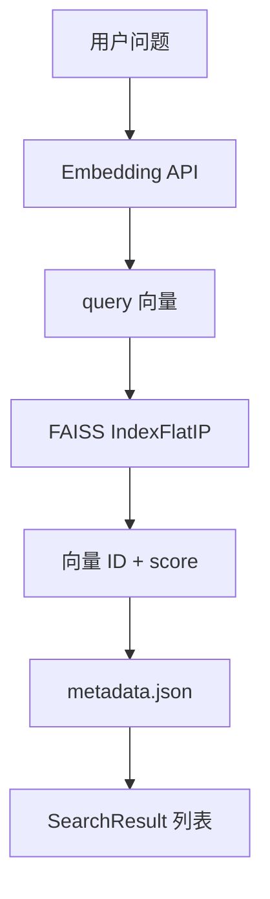

# 模块作用

**FAISS**（Facebook AI Similarity Search）在本项目中是 **向量搜索引擎**——负责存储文档 Embedding，并在用户提问时 **毫秒级** 找出语义最相似的 Top-K 文本块。

没有 FAISS（或同类向量库），RAG 只能暴力算每条 query 与所有 chunk 的余弦相似度，文档一多就慢。

封装代码：`backend/rag/vectorstore.py` 的 `FaissVectorStore` 类。

# 核心原理

## 向量相似度直觉

Embedding 把文本变成高维空间里的一个点（如 1536 维）。语义相近的文本，点距离 **更近**。

用户问题也变成点，找 **最近邻** = 找最相关文档。

## 余弦相似度 vs 内积

余弦相似度看 **方向** 不看长度。FAISS 用 `IndexFlatIP`（内积索引），配合 **L2 归一化** 后，内积等价于余弦相似度。

## IndexFlatIP 是什么

**暴力精确搜索**：遍历所有向量算相似度，100% 准确，适合 **中小规模**（几万条以内）和 **教学/demo**。

大规模要用 IVF、HNSW 等近似索引，牺牲一点精度换速度。

## 为什么向量与原文分开存

FAISS 只存浮点数组，不存文本。搜索返回 **向量下标**（0, 1, 2...），再用下标去 `metadata.json` 取原文、页码、来源。

# 项目中的实现方式

## 磁盘结构

```
backend/rag/store/          # config: rag_store_path
├── faiss.index             # 二进制向量索引
├── metadata.json           # chunk 文本与元数据
└── uploads/                # 上传的 PDF 原文件
```

## 类初始化

```52:69:backend/rag/vectorstore.py
class FaissVectorStore:
    def __init__(self, store_dir=None):
        // ...
        if self.index_path.exists() and self.metadata_path.exists():
            self.load()
```

启动时自动 load 已有索引，无需手动 warm-up。

## 写入 add_embeddings

步骤（代码注释 82-87 行）：

1. 校验向量维度一致
2. numpy float32 矩阵
3. `faiss.normalize_L2(vectors)`
4. `IndexFlatIP(dim)` 或 `index.add()`
5. 同步 append `metadata` 列表

metadata 每条含：`chunk_id`, `text`, `source`, `page`, `char_count`, `embedding_model`

## 持久化 save / load

- `faiss.write_index` / `faiss.read_index`
- `metadata.json` 格式：`{ version, dimensions, total, chunks: [...] }`
- load 时校验 `ntotal == len(metadata)`，防损坏

## 搜索 search

```200:279:backend/rag/vectorstore.py
def search(self, query_embedding, top_k=None) -> list[SearchResult]:
    // L2 归一化 query
    // scores, indices = self._index.search(query_vec, k)
    // 用 indices 查 metadata → SearchResult
```

- `top_k` 默认 `config.retrieval_top_k`（3）
- `k = min(k, self.count)` 防 K 大于总量
- `idx < 0` 跳过（FAISS 无效位）

## 谁在使用 FaissVectorStore

| 调用方 | 场景 |
|--------|------|
| `rag/ingest.py` | 入库 add + save |
| `rag/retriever.py` | 问答检索 |
| `tools/search_docs.py` | Agent 工具检索 |

# 数据流

## 入库

```
EmbeddedChunk[].embedding  (list[float])
    ↓ numpy (n, dim) + normalize_L2
    ↓ index.add()
    ↓ metadata.append(text, source, page...)
    ↓ save() → 磁盘
```

## 检索

```
embed_text(question) → query_embedding
    ↓ normalize_L2
    ↓ index.search(query, k=3)
    ↓ scores=[0.82, 0.71, ...], indices=[5, 12, 3]
    ↓ metadata[5], metadata[12]...
    ↓ SearchResult(rank, score, chunk)
```



# 面试题

> 每题提供两版回答：**30 秒版**适合开场快速应答，**2 分钟版**适合面试官追问「展开讲讲」。

## FAISS 是什么？为什么 RAG 需要它？

### 简短回答（30秒版）

FAISS 是 Meta 开源的向量相似度搜索库。RAG 把大量 chunk 向量存进去，query 向量一次 search 拿 Top-K，比 Python 循环算余弦快几个数量级。

### 深入回答（2分钟版）

本项目 `FaissVectorStore` 封装 faiss-cpu：`add_embeddings` 写入、`search` 检索。RAG 在线路径 question→embed→`vectorstore.search()`→metadata 取原文。没有 FAISS 就要 O(n) 暴力算每条 chunk 与 query 的相似度，文档上万条就慢。IndexFlatIP + L2 归一化实现精确余弦检索，适合 demo 规模。

## IndexFlatIP 和 IndexFlatL2 区别？

### 简短回答（30秒版）

IP 是内积，L2 是欧氏距离。我们对向量 L2 归一化后用 IP，等价余弦相似度。未归一化时 IP 会偏向长向量。

### 深入回答（2分钟版）

`vectorstore.py` 创建 `faiss.IndexFlatIP(dim)`，add 和 search 前都 `faiss.normalize_L2`。归一化后 dot product = cosine similarity，分数越高越相关。若用 IndexFlatL2 则度量欧氏距离，越小越近，语义检索常用 cosine/IP。选型取决于 embedding 模型是否已归一化；我们统一 L2 norm 保证可比性。

## 为什么要 L2 归一化？

### 简短回答（30秒版）

把向量缩放到单位长度，归一化后内积就等于余弦相似度。入库和查询都要归一化，否则分数不可比。

### 深入回答（2分钟版）

`add_embeddings` 里 vectors 和 `search` 里 query_vec 都调 `faiss.normalize_L2`。Embedding 模型输出未归一化时，长文本向量模长大，raw 内积会偏向长 chunk。归一化后只比方向（语义），不比长度。漏归一化一侧是常见 bug，会导致检索质量骤降。

## 向量存在哪？原文存在哪？

### 简短回答（30秒版）

向量在 `rag/store/faiss.index`；chunk 原文、来源、页码在 `rag/store/metadata.json`。FAISS 只返回向量 ID，再用 ID 查 metadata 取文本。

### 深入回答（2分钟版）

FAISS 二进制索引只存 float32 矩阵；`metadata.json` 的 chunks 数组与 FAISS 内部 ID（0,1,2...）一一对应。`search` 返回 indices 和 scores，组装 `SearchResult` 时从 metadata 建 `TextChunk`。upload PDF 原文件在 `uploads/`。这种「向量引擎 + 侧车 metadata」是常见 RAG 存储模式。

## 相似度 score 多少算「相关」？

### 简短回答（30秒版）

没有 universal 阈值，取决于 embedding 模型和是否归一化。一般看相对排序 Top-1 vs Top-3，结合人工抽检定标，别直接把 score 当概率。

### 深入回答（2分钟版）

IndexFlatIP 归一化后 score 在 [-1,1] 附近，常 0.3～0.9。不同文档库分布不同，0.7 在一个库 relevant 在另一个库可能噪声。实践：看 Top-K 分差、A/B 人工标注、设最低分过滤（低于阈值返回「未找到」）。`format_search_results` 展示 score 便于 debug，产品 UI 慎用「置信度 82%」误导用户。

## FAISS 和 Milvus/Chroma 怎么选？

### 简短回答（30秒版）

FAISS 是嵌入式库，适合单机 demo。Milvus/Qdrant/Chroma 是向量数据库，适合生产海量、多租户、过滤查询和分布式。

### 深入回答（2分钟版）

本项目 FaissVectorStore 进程内 load/save 本地文件，无 HTTP API、无多副本同步。优势：零依赖、教学清晰、latency 低。短板：难水平扩展、无按 metadata filter 原生支持（需自实现）。生产百万向量+多实例应迁 Milvus/Qdrant，API 层 retriever 接口可保持不变，只换 store 实现。

## 增量追加 PDF 会怎样？

### 简短回答（30秒版）

`add_embeddings` 是追加模式，`save` 覆盖写盘。新 PDF 不会删旧向量，索引总量累加。

### 深入回答（2分钟版）

每次 upload 走 ingest→add→save，faiss.index 和 metadata.json 全量重写但内容累积。chunk_id 在 metadata 里递增。删某 PDF 的所有 chunk 当前未实现，Flat 索引也难高效单条 delete。运维需知：重复上传同名 PDF 会 duplicate chunks，除非加 dedup 逻辑。

## 换 Embedding 模型要注意什么？

### 简短回答（30秒版）

维度可能变，必须重建索引，旧 faiss.index 不能和新 query 混用。改 `.env` 的 EMBEDDING_MODEL 后重新 ingest 全部文档。

### 深入回答（2分钟版）

`add_embeddings` 校验 dim 一致；load 后 search 检查 `len(query_embedding) == self._dimensions`。embedding-3 与 text-embedding-3-small 维度可能不同。换模型步骤：清空或新 store_dir→重新 ingest→验证 search。metadata 里 `embedding_model` 字段可审计用的哪个模型 embed 的。

## metadata 和 FAISS 不一致会怎样？

### 简短回答（30秒版）

load 时若 `ntotal != len(metadata)` 会抛 ValueError，防止用损坏索引检索到错文本。

### 深入回答（2分钟版）

`load()` 显式校验向量数与 metadata 条数。原因：save 中断、手改 JSON、只复制了 index 没复制 metadata。生产应 backup 成对文件，checksum 校验。不一致时宁可 fail fast 也不要 silent wrong chunk。

## Top-K 检索的性能复杂度？

### 简短回答（30秒版）

IndexFlatIP 搜索是 O(n×d)，n 向量数 d 维度。n 到百万级就要换 IVF、HNSW 等近似索引。

### 深入回答（2分钟版）

暴力精确搜索保证 recall@K=100%（真最近邻），我们 demo chunk 数百上千条完全够。瓶颈在 embed API 而非 FAISS search。扩展：IVFFlat 训练聚类加速；HNSW 图索引；GPU faiss batch search。K 通常 3～10，`config.retrieval_top_k=3`。

## GPU 版 FAISS 有用吗？

### 简短回答（30秒版）

数据量大、batch query 多时有帮助。我们 demo 规模 CPU faiss-cpu 足够，面试可提知道 GPU 选项。

### 深入回答（2分钟版）

faiss-gpu 适合百万级以上向量、高 QPS 检索服务。本项目 ingest 一次 search 少量，CPU IndexFlatIP 毫秒级。若迁 GPU 需改依赖、保证向量在 GPU 内存、batch search API 不同。成本收益要在 profiling 后决定，不是默认必上。

## 如何实现删除某个 PDF 的所有 chunk？

### 简短回答（30秒版）

Flat 索引不支持高效单条删。可用 IDMap+remove_ids、重建索引，或换支持 delete 的向量库，或按 source 过滤后重建。

### 深入回答（2分钟版）

当前未实现 delete。workaround：读 metadata 过滤掉某 source 的 chunks，重新 embed 剩余文本建 new index。FAISS IDMap2 维护 id 映射支持 remove_ids 但 Flat 重建仍常见。产品需求「删文档」要在 ingest 层设计 source 版本号和 reindex 任务，不能 assume FAISS 自带 CRUD。

# 容易踩坑的问题

1. **空索引 search**：返回 `[]`，上层要处理「无结果」。
2. **query 维度不对**：直接 ValueError，常见于换 embedding 模型后忘记重建。
3. **未 save 就重启**：内存有数据，磁盘无，重启丢失。
4. **metadata 过大**：全文存 JSON，超大库 JSON 读写慢，生产可只存 preview + 外存全文。
5. **score 当概率**：内积分数不是 0～1 概率，别当 confidence 展示。

# 进阶知识

- **IndexIVFFlat / IndexHNSW**：近似最近邻
- **IDMap2**：向量带自定义 ID，支持 delete
- **PQ 量化**：压缩向量减内存
- **Metadata filtering**：先 filter source 再 vector search
- **Sharding**：按 tenant 分索引

**相关文档**：[rag.md](./rag.md) · [tool-calling.md](./tool-calling.md)
