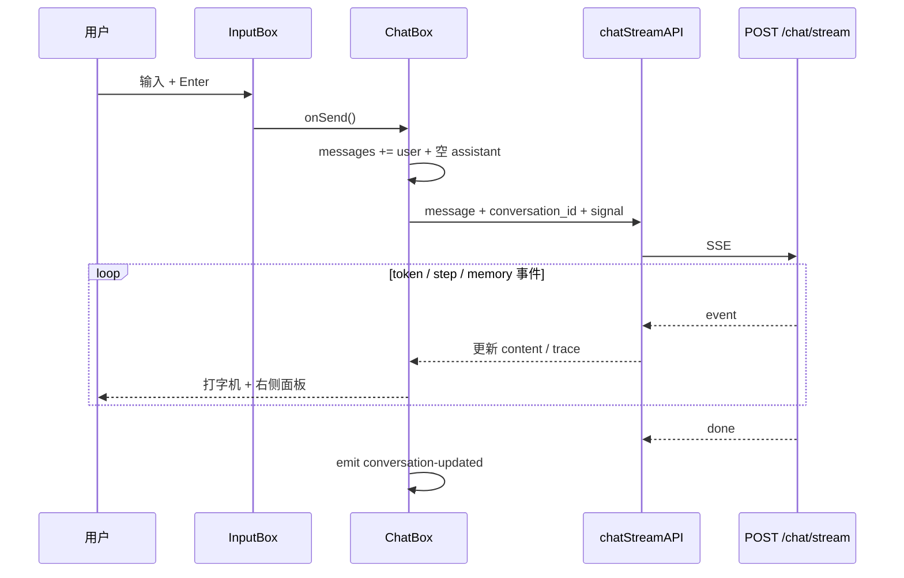

# 模块作用

> **面试约定**：以仓库真实代码为准；本文档是复习提纲。

**Frontend（Vue 3 前端）** 是用户与 AI Agent 系统的 **交互界面**。

它负责：

- 展示聊天消息（用户 / 助手气泡），默认 **SSE 流式**打字机效果
- 调用 `POST /chat/stream`，实时展示 token 与 ReAct steps
- 上传多格式文档/图片到知识库（`POST /documents/upload`）
- 管理 `session_id` / `conversation_id`（同一 UUID），会话侧栏列表与恢复
- 登录鉴权（JWT）、执行可视化、引用、记忆与评估面板
- 「停止生成」：`AbortController` 取消 in-flight 流式请求

没有前端，后端 API 仍可用（curl / Swagger），但普通用户无法方便地使用 RAG + Agent 能力。

# 核心原理

## SPA + REST / SSE

Vue 3 单页应用（Vite 构建）通过 Axios 调 JSON API，流式聊天用 `fetch` + SSE 解析（`utils/sse.js`）。状态主要在组件 `ref` / `emit` 本地维护，不用 Vuex/Pinia（当前体量够用）。

## Session / Conversation 续聊

```
第一次聊天: conversation_id=null → 后端新建 UUID → 返回 session_id
前端: localStorage.setItem('chat_session_id', id)
后续聊天: 带上 id + Bearer Token → 后端加载 Session + Conversation 持久化
刷新页面: GET /conversations/{id} 恢复消息与 steps meta
新对话: clearSessionId + 清空 messages + 可选新建 conversation
```

## Agent 可视化（已落地）

后端 SSE 推送 `step` 事件 / JSON 返回 `steps`；前端：

- `ExecutionViewer`：Thought / Action / Observation 时间线
- `CitationPanel`：RAG 引用
- `MemoryPanel`：短期 / 长期 / 本轮检索记忆
- `DebugInspector`：调试面板

# 项目中的实现方式

## 技术栈

| 项 | 选型 |
|----|------|
| 框架 | Vue 3（Composition API / `<script setup>`） |
| 构建 | Vite 8 |
| HTTP | Axios（JSON）+ fetch SSE |
| 样式 | Tailwind CSS 4 + `App.css` |
| 语言 | JavaScript（无 TypeScript） |

## 组件树

```
App.vue
└── ChatPage.vue
    ├── ConversationSidebar.vue   → /conversations CRUD
    ├── TopBar.vue / AuthBar.vue  → 登录注册
    ├── ChatBox.vue               → 聊天主控（默认 stream）
    │   ├── MessageList.vue
    │   ├── InputBox.vue          → 发送 / 停止生成 / 附件
    │   └── UploadPanel（经 InputBox / useUpload）
    └── DebugInspector.vue
        ├── ExecutionViewer.vue
        ├── CitationPanel.vue
        ├── MemoryPanel.vue
        └── RagEvalPanel.vue（评估）
```

## API 服务层

`frontend/src/services/api.js`：

- Axios `baseURL`：`VITE_API_BASE_URL` 或同域 `window.location.origin`
- 请求拦截器自动带 `Authorization: Bearer <token>`
- `chatStreamAPI`：`POST /chat/stream`（主路径）
- `chatAPI`：`POST /chat`（兼容）
- `fetchConversations` / `fetchConversation` / 重命名 / 删除
- `loginAPI` / `registerAPI`、上传、记忆概览、评估列表等

| 能力 | 说明 |
|------|------|
| 流式聊天 | SSE；支持 AbortSignal |
| 上传 | FormData；超时更长（解析 + Embedding） |
| 会话 | conversation_id ≡ session_id |

## ChatBox — 聊天主控

`frontend/src/components/ChatBox.vue`：

1. `handleSend`：追加 user + 空 assistant → `chatStreamAPI`，按事件更新 content / trace
2. `emit('execution-change')` / `memory-change` 驱动右侧面板
3. `handleStop`：`abortControllerRef.abort()`
4. 新对话 / 恢复会话：清空或 `restoreMessages` 从 Conversation 详情灌入

## UploadPanel / 附件

- 支持扩展名见 `utils/fileTypes.js`：PDF、DOCX、TXT、MD、常见图片等
- 前端 `ACCEPT_ATTR` 与后端 `file_parser` 对齐

## ChatPage — 布局

左侧会话列表、中间聊天、右侧 Inspector（桌面默认打开）。挂载时 `fetchConversations` + 按需 `restoreConversation`。

## 已接入的后端能力

| API | 状态 |
|-----|------|
| `POST /chat/stream` | ✅ 默认聊天路径 |
| `POST /chat` | ✅ 兼容保留 |
| `POST /documents/upload` | ✅ |
| `/conversations*` | ✅ 侧栏 |
| `/auth/*` | ✅ AuthBar |
| `/memory/*` | ✅ MemoryPanel |
| `/rag/evaluations*` | ✅ RagEvalPanel |
| ReAct steps / citations | ✅ ExecutionViewer + CitationPanel |

# 数据流

## 发送一条消息（流式）



## 刷新恢复

```
ChatPage onMounted
  → fetchConversations
  → fetchConversation(sessionId)
  → ChatBox.restoreMessages(messages with meta.steps)
```

# 面试题

> 每题提供两版回答：**30 秒版**适合开场快速应答，**2 分钟版**适合面试官追问「展开讲讲」。

## 前后端怎么通信？为什么用 Axios + fetch SSE？

### 简短回答（30秒版）

JSON 用 Axios（baseURL、超时、Bearer 拦截器）。流式聊天用 fetch + SSE 解析，因为 Axios 对 SSE 支持弱。开发 Vite 5173、API 8000 靠 CORS。

### 深入回答（2分钟版）

`api.js` 统一鉴权头；`utils/sse.js` 的 `postSSE` 读 ReadableStream 解析 `event:` / `data:`。上传仍走 Axios FormData。比引入重型状态库更轻；面试可对比 EventSource（只支持 GET）与 fetch POST SSE。

## session_id / conversation_id 存在哪里？刷新会怎样？

### 简短回答（30秒版）

localStorage 存同一 UUID。刷新后调 `/conversations/{id}` 恢复气泡与 steps；短期 Session 在后端内存，重启可能空，但 SQLite Conversation 仍可拉 UI 历史。

### 深入回答（2分钟版）

`getSessionId` / `setConversationId` 共用 key。侧栏列表来自 SQLite。新对话 clear id 并可选 `POST /conversations`。鉴权用户隔离，不能读别人的 conversation（403）。

## 为什么 chat 和 upload 的 timeout 不同？

### 简短回答（30秒版）

Agent 多轮 LLM 约分钟级；文档入库含解析和 Embedding 更久，upload 单独更长超时，避免 axios 过早杀掉仍在处理的请求。

### 深入回答（2分钟版）

大文件 chunk+embed 可能接近一分钟。timeout 过短会导致前端失败、后端仍半入库。生产可改异步 job + 轮询。流式聊天主要靠 AbortSignal，而非短 timeout。

## 前端如何实现 Agent 执行过程可视化？

### 简短回答（30秒版）

SSE `step` 事件写入消息 `trace.steps`，ChatBox `emit('execution-change')`，右侧 `ExecutionViewer` 渲染 Thought/Action/Observation；`CitationPanel` 从 steps 抽引用。

### 深入回答（2分钟版）

`traceParser.js` 维护流式 trace 状态与 citations。选中历史消息可回放该轮 steps / retrieved memories。这是产品化的可观测性，面试可对着 Demo 讲。

## 停止生成怎么做的？

### 简短回答（30秒版）

InputBox「停止生成」→ `AbortController.abort()` → 浏览器断开 SSE → 后端 `is_disconnected` / 取消标志结束 Agent 循环。已输出的 token 保留在界面。

### 深入回答（2分钟版）

详见 [stop-generation.md](./stop-generation.md)。新对话时也会 abort in-flight 请求，避免旧流写进新会话 UI。

## 为什么默认用 SSE 而不是一次性 JSON？

### 简短回答（30秒版）

降低首字等待、可逐步展示 ReAct step，并支持中途取消。`POST /chat` JSON 仍保留兼容。

### 深入回答（2分钟版）

见 [streaming.md](./streaming.md)。Vue 响应式更新 assistant `content` 即打字机效果。Session/Conversation 在 stream 正常结束后再持久化。

## 消息列表怎么持久化？

### 简短回答（30秒版）

组件内 `ref` 是展示层；权威数据在后端 `ConversationStore`（SQLite）。刷新靠拉 conversation 详情，不是只靠 localStorage 消息镜像。

### 深入回答（2分钟版）

早期 MVP 刷新会空白；现在侧栏 + restore 已接好。Session 仍服务 Agent Prompt；Conversation 服务 UI。多 tab 以服务端为准。

## 如何防止用户重复点击发送？

### 简短回答（30秒版）

`loading` 为 true 时 `handleSend` 直接 return；InputBox 生成中切「停止」态。

### 深入回答（2分钟版）

可防止 double submit 双倍 token。并发上一轮未结束时应用 abort 再发，或禁用发送直至结束——当前以 loading 门禁为主。

## CORS 错误前端怎么排查？

### 简短回答（30秒版）

看控制台 CORS；确认 `VITE_API_BASE_URL`；确认后端 `cors_origins`；检查 HTTPS 页请求 HTTP。

### 深入回答（2分钟版）

生产应用具体域名而非 `*`；带 credentials 时不能 `*`。同域部署（`serve_frontend`）可减少跨域问题。

## 鉴权前端怎么接的？

### 简短回答（30秒版）

注册/登录拿 JWT 存 localStorage，Axios 拦截器带 Bearer。开发 `auth_disabled` 时可无 Token。

### 深入回答（2分钟版）

`AuthBar` + `setAuthSession`。登出 `clearAuthSession` 同时清 conversation id。多用户下文档与记忆按 user 隔离，前端勿缓存跨用户数据。

## Upload 为什么不只限 PDF？

### 简短回答（30秒版）

后端 `file_parser` 已支持 PDF/DOCX/TXT/MD/图片等；前端 `fileTypes.js` 的 accept 与之对齐。

### 深入回答（2分钟版）

图片走视觉模型解析（`openai_vision_model`）。面试说清「解析层与向量入库分层」，不要只说 PDF。

## 生产环境前端部署要注意什么？

### 简短回答（30秒版）

`npm run build`；Nginx 或后端 `serve_frontend` 托管 dist；正确 API 基址；HTTPS；CORS 白名单；Token 防 XSS。

### 深入回答（2分钟版）

环境变量 build 时注入。静态缓存 + SPA fallback。安全：不把 API secret 放前端；CSP；监控 4xx/5xx。

# 容易踩坑的问题

1. **后端未启动**：前端「无法连接服务器」。
2. **VITE_API_BASE_URL 未配**：部署连错环境。
3. **说成 React**：实际是 Vue 3（`package.json` + `*.vue`）。
4. **以为 steps 未做**：已接入 ExecutionViewer。
5. **新对话只清前端**：应 abort 流 + clear id；后端旧 Session 可能残留内存（可接受）。

# 进阶知识

- **Pinia**：跨页共享会话状态
- **SSE 与重连**：断线续传、Last-Event-ID
- **markdown 渲染**：助手回复代码块/表格
- **Vitest + Vue Test Utils**：组件测试
- **i18n**：界面多语言

**相关文档**：[backend.md](./backend.md) · [streaming.md](./streaming.md) · [stop-generation.md](./stop-generation.md) · [architecture.md](./architecture.md)
