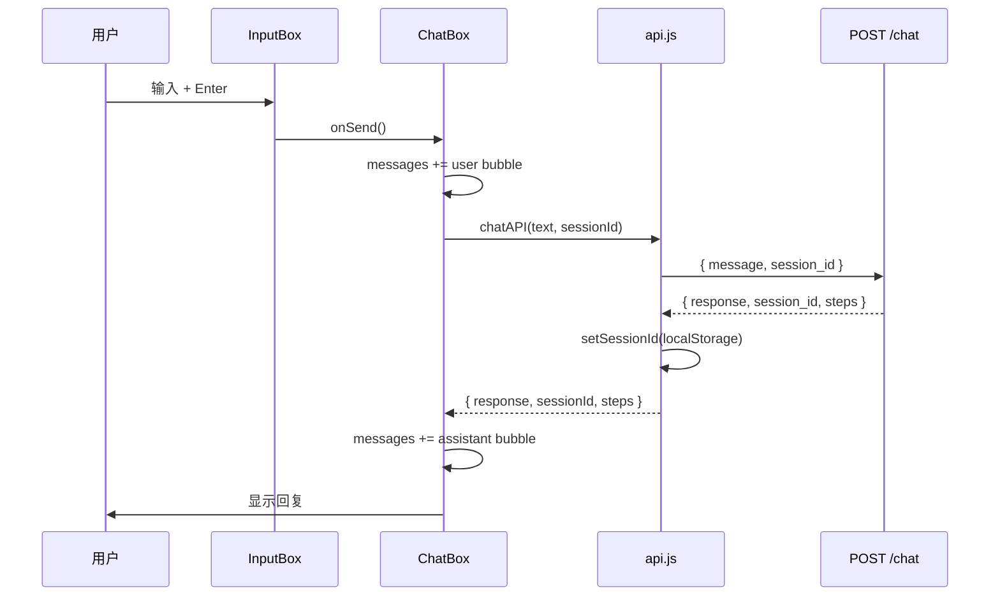

# 模块作用

**Frontend（React 前端）** 是用户与 AI Agent 系统的 **交互界面**。

它负责：

- 展示聊天消息（用户 / 助手气泡）
- 发送问题到 `POST /chat`，展示 Agent 最终回复
- 上传 PDF 到知识库（`POST /documents/upload`）
- 管理 `session_id`，支持多轮对话和「新对话」
- **预留** Agent 执行可视化侧边栏（Thought / Action / Observation 时间线）

没有前端，后端 API 仍可用（curl / Swagger），但普通用户无法方便地使用 RAG + Agent 能力。

# 核心原理

## SPA + REST API

React 单页应用（Vite 构建）通过 Axios 调用 FastAPI JSON API。状态主要在 React `useState` 本地维护，**不**用 Redux 等全局库（MVP 足够简单）。

## Session 续聊原理

```
第一次聊天: session_id=null → 后端新建 UUID → 返回 session_id
前端: localStorage.setItem('chat_session_id', id)
后续聊天: 带上 session_id → 后端加载历史
新对话: 清除 localStorage + 清空 messages state
```

## Agent 可视化（设计 vs 现状）

后端 `ChatResponse.steps` 已包含完整 ReAct trace：

```json
{
  "step": 1,
  "thought": "需要查文档...",
  "action": "search_docs({\"query\": \"报销\"})",
  "observation": "[1] 手册.pdf p.2 ...",
  "final_answer": null
}
```

`api.js` 的 `chatAPI()` **已返回** `steps`，但 `ChatBox.jsx` 目前 **只解构了 response**，未渲染 steps。`ChatPage.jsx` 的 `<aside>` 标注为 Execution Viewer 预留区。

# 项目中的实现方式

## 技术栈

| 项 | 选型 |
|----|------|
| 框架 | React 19 |
| 构建 | Vite 8 |
| HTTP | Axios |
| 语言 | JSX（无 TypeScript） |
| 样式 | `App.css` 纯 CSS |

## 组件树

```
App.jsx
└── ChatPage.jsx
    ├── header（标题 + 副标题）
    ├── UploadPanel.jsx      → POST /documents/upload
    ├── ChatBox.jsx          → 聊天主控
    │   ├── MessageList.jsx  → 消息列表 + loading + error
    │   └── InputBox.jsx     → 输入框
    └── aside（sidebar 预留，aria-hidden）
```

## API 服务层

`frontend/src/services/api.js`：

```javascript
const API_BASE_URL = import.meta.env.VITE_API_BASE_URL || 'http://localhost:8000';

export async function chatAPI(message, sessionId = getSessionId()) {
  const { data } = await client.post('/chat', {
    message,
    session_id: sessionId || null,
  });
  setSessionId(data.session_id);
  return {
    response: data.response,
    sessionId: data.session_id,
    steps: data.steps || [],  // ← 已返回，UI 未用
  };
}

export async function uploadDocument(file) {
  // FormData, timeout 120s
}
```

| 函数 | Timeout | 说明 |
|------|---------|------|
| `chatAPI` | 60s | Agent 多轮可能较慢 |
| `uploadDocument` | 120s | PDF 解析 + Embedding 耗时 |

环境变量：`frontend/.env.example` → `VITE_API_BASE_URL=http://localhost:8000`

## ChatBox — 聊天主控

`frontend/src/components/ChatBox.jsx` 核心逻辑：

1. `handleSend`：追加 user 消息 → `setLoading(true)` → `chatAPI(text, sessionId)`
2. 成功：追加 assistant 消息，更新 sessionId
3. 失败：展示 `err.response.data.detail` 或网络错误
4. `handleNewChat`：`clearSessionId()` + 清空 messages

**注意第 29 行**：

```javascript
const { response, sessionId: newSessionId } = await chatAPI(text, sessionId);
// steps 被丢弃，未存入 state
```

## MessageList — 消息展示

- `MessageBubble`：区分 user / assistant 样式
- `LoadingBubble`：三点 typing 动画
- `useEffect` + `scrollIntoView`：新消息自动滚到底
- 空状态：「输入问题开始对话。」

## UploadPanel — PDF 上传

- 隐藏 `<input type="file" accept=".pdf">`
- 前端校验扩展名 `.pdf`
- 成功后显示：`新增 X 个片段（知识库共 Y 个）`
- 上传完成后 Agent 可通过 `search_docs` 检索（无需刷新页面）

## ChatPage — 布局

```jsx
<aside className="chat-page__sidebar" aria-hidden="true" />
```

侧边栏当前为空，注释说明预留 Execution Viewer（agent steps、tool calls、RAG citations）。

## 未接入的后端能力

| API | 状态 |
|-----|------|
| `POST /chat` | ✅ 已接入 |
| `POST /documents/upload` | ✅ 已接入 |
| `POST /rag/ask` | ❌ 无独立页面（通过 Agent search_docs 间接使用） |
| `POST /rag/ingest` | ❌ 无前端入口 |
| `ChatResponse.steps` | ⚠️ API 已返回，UI 未展示 |

# 数据流

## 发送一条消息



## 上传 PDF

```
用户选文件 → UploadPanel 校验 PDF
  → FormData POST /documents/upload
  → 后端 ingest_pdf → FAISS
  → 显示 chunksAdded / totalChunks
```

## 实现 Agent 可视化的建议数据流

```
chatAPI 返回 steps
  → ChatBox setState({ steps, messages })
  → 传给 Sidebar / ExecutionViewer
  → 按 step 渲染 Thought → Action → Observation 时间线
  → 最后一步显示 Final Answer
```

# 面试题

> 每题提供两版回答：**30 秒版**适合开场快速应答，**2 分钟版**适合面试官追问「展开讲讲」。

## 前后端怎么通信？为什么用 Axios？

### 简短回答（30秒版）

REST JSON over HTTP。Axios 封装 baseURL、timeout 和错误处理。Vite 开发时前端 5173、后端 8000，靠 CORS 跨域。

### 深入回答（2分钟版）

`frontend/src/services/api.js` 创建 axios instance，`baseURL` 来自 `VITE_API_BASE_URL` 默认 localhost:8000。chat 用 JSON POST `/chat`；upload 用 FormData POST `/documents/upload`。Axios 统一拦截错误、`err.response.data.detail` 展示后端 503/502 信息。比 fetch 少写样板代码；比 React Query 轻，适合 MVP。

## session_id 存在哪里？刷新页面会怎样？

### 简短回答（30秒版）

存在 localStorage，key 是 `chat_session_id`。刷新后 ID 还在，能续后端 Session（后端未重启前提下）。消息 UI 在 React state，刷新会清空。

### 深入回答（2分钟版）

`getSessionId/setSessionId/clearSessionId` 管理 localStorage。每次 chatAPI 成功写回新 session_id。「新对话」按钮 clearSessionId 并清空 messages。刷新：session_id 持久、messages 丢失，用户看到空界面但下一条消息可能带历史 context——前后端体验不一致。改进：mount 时拉 session history 或 localStorage 缓存 messages。

## 为什么 chat 和 upload 的 timeout 不同？

### 简短回答（30秒版）

Agent 多轮 LLM 大约 60s 内；PDF 入库含解析和 Embedding 更久，upload 设 120s，避免 axios 过早 timeout。

### 深入回答（2分钟版）

api.js 默认 client timeout 60000；uploadDocument 单独 120000。大 PDF chunk+embed 可能接近一分钟。timeout 过短会前端报失败而后端仍处理中，造成重复上传。生产可改异步 job：上传返回 task_id，轮询状态，timeout 只约束「提交」而非「完成」。

## 前端如何实现 Agent 执行过程可视化？

### 简短回答（30秒版）

用 `ChatResponse.steps` 渲染时间线：每步 Thought、Action、Observation，Final Answer 高亮。可放 ChatPage 右侧 aside 或消息下方折叠面板。

### 深入回答（2分钟版）

后端已返回 `ReActStepSchema[]`（step/thought/action/observation/final_answer）。chatAPI 已解析 `steps`，但 ChatBox 未存 state。实现：ChatBox `setSteps(newSteps)`，ChatPage aside 渲染 ExecutionViewer 组件，按 step 序号展示，Observation 可折叠，search_docs 结果高亮来源。这是「Agent 可视化」的产品化，面试可主动说后端 ready、前端待做。

## 当前 steps 为什么没展示？你会怎么改？

### 简短回答（30秒版）

ChatBox 解构 chatAPI 返回值时只用了 response 和 sessionId，忽略了 steps。加 `useState(steps)`，send 后 setSteps，传给 sidebar 组件即可。

### 深入回答（2分钟版）

`ChatBox.jsx` 第 29 行：`const { response, sessionId } = await chatAPI(...)` 丢弃 steps。改法：`const [steps, setSteps] = useState([])`；handleSend 里 `setSteps(newSteps)`；ChatPage 把 steps 传给 `<ExecutionViewer steps={steps} />`。样式用 timeline CSS。新对话时 clear steps。可选：每轮 assistant 消息旁加「查看推理」展开该次 steps。

## 为什么没有用 WebSocket / SSE？

### 简短回答（30秒版）

MVP 请求-响应足够简单。流式输出和实时 trace 推送适合 SSE/WebSocket，需要后端改 stream，复杂度更高。

### 深入回答（2分钟版）

当前同步等完整 ChatResponse。SSE 价值：Final Answer 打字机效果、逐步显示 ReAct step 降低等待焦虑。需 `llm.py` stream + FastAPI StreamingResponse + 前端 EventSource。WebSocket 适合双向（中断生成）。Agent 多步 trace 推送比纯 RAG 流式更复杂。选型：先 SSE 只流 final token，trace 仍一次性返回。

## 消息列表为什么只存在 React state？

### 简短回答（30秒版）

MVP 最简单。缺点是刷新丢失 UI 历史。可改进：后端 GET session messages，或 localStorage 缓存展示层。

### 深入回答（2分钟版）

ChatBox 用 `useState([])` 存 messages，createMessage 递增 id。无 global store、无 persist。优点：代码少。缺点：刷新空白、多 tab 不同步。Session 在后端有 history 但前端没拉。扩展：React Query 缓存；hydrate 时 POST /chat 不带 message 只拉 history 需新 API；或 localStorage mirror messages（注意隐私）。

## 如何防止用户重复点击发送？

### 简短回答（30秒版）

loading 为 true 时 handleSend 直接 return，InputBox disabled={loading}。我们已实现。

### 深入回答（2分钟版）

ChatBox：``if (!text || loading) return``；setLoading(true) 在 try/finally false。InputBox 禁输入和按钮。可防止 double submit 导致重复 Agent 运行和双倍 token 成本。还可加：debounce Enter、发送中 disable「新对话」、request id 去重。并发两条 in-flight 目前未防，可加 abortController 取消上一轮。

## CORS 错误前端怎么排查？

### 简短回答（30秒版）

看浏览器控制台 blocked by CORS；确认 VITE_API_BASE_URL 指向正确后端；确认后端 CORSMiddleware 已开；检查 mixed content（HTTPS 页请求 HTTP API）。

### 深入回答（2分钟版）

典型报错：No Access-Control-Allow-Origin。排查链：Network tab 看 preflight OPTIONS；backend main.py allow_origins；开发是否 5173→8000；生产是否域名不匹配。axios baseURL  typo 导致 404 有时误似 CORS。credentials 模式需具体 origin 不能 `*`。Postman 能通但浏览器不通，基本就是 CORS。

## 如果要加流式打字机效果，改哪里？

### 简短回答（30秒版）

后端 llm stream + API SSE；前端 EventSource 或 fetch reader 逐 token append 到 assistant bubble。Agent 模式需定义流 Final Answer 还是流 trace。

### 深入回答（2分钟版）

最小改动：仅 RAG 或 Agent 最后一答 stream。ChatBox 增加 streamingMessage state，append delta.content。axios 不支持 SSE，用 fetch + ReadableStream 或 eventsource。UI：LoadingBubble 改为 growing text。Agent 若 stream trace，aside 逐步 append step。Session add_turn 移到 stream end 事件。

## UploadPanel 为什么只接受 PDF？

### 简短回答（30秒版）

后端 loader 目前 PDF 入库路径最完整；前端校验扩展名与后端一致。扩展 docx/md 需前后端同时改。

### 深入回答（2分钟版）

UploadPanel 检查 `.pdf`；documents API 调 ingest_pdf。pypdf 提取文本。扫描 PDF 无 OCR 会失败。产品文案写「供 search_docs 检索」对齐能力边界。加 docx：loader 新函数、accept 属性、后端 MIME 校验、ingest 路由分支。

## 生产环境前端部署要注意什么？

### 简短回答（30秒版）

npm run build 静态文件放 Nginx；VITE_API_BASE_URL 指向生产 API；HTTPS；CORS 限定域名；不要开发环境的 allow_origins=*。

### 深入回答（2分钟版）

Vite build 输出 dist/，Nginx root + try_files SPA fallback。环境变量 build 时注入，staging/prod 不同 .env.production。API 独立域名 api.example.com，CORS 白名单 frontend 域名。开启 gzip/brotli；静态资源 cache。安全：不在 frontend 存 API secret；session_id localStorage 在 XSS 下可被偷，需 CSP。Monitor 4xx/5xx 和 LCP。

# 容易踩坑的问题

1. **后端未启动**：前端显示「无法连接服务器」，需先 `uvicorn main:app`。
2. **VITE_API_BASE_URL 未配**：默认 localhost:8000，部署忘改会连错环境。
3. **steps 已有但未用**：面试说「支持可视化」要诚实：后端 ready，前端待做。
4. **新对话只清前端**：localStorage 清了，但用户可能期望后端也删 Session（当前未提供 DELETE API）。
5. **长回复无 markdown**：`message-content` 纯文本 `<p>`，表格/代码块不渲染。

# 进阶知识

- **React Query / SWR**：请求缓存与重试
- **SSE 流式 UI**：`ReadableStream` 逐 token 渲染（详见 [stop-generation.md](./stop-generation.md)）
- **ExecutionViewer 组件设计**：步骤条 + 工具图标 + 可展开 Observation
- **react-markdown**：助手回复支持 Markdown
- **i18n**：界面多语言
- **Vitest + Testing Library**：组件测试

## 快速实现 ExecutionViewer（练习）

```jsx
// ChatBox.jsx 中
const [steps, setSteps] = useState([]);

const { response, sessionId: newSessionId, steps: newSteps } = await chatAPI(text, sessionId);
setSteps(newSteps);

// ChatPage.jsx 中
<aside className="chat-page__sidebar">
  <ExecutionViewer steps={steps} />
</aside>
```

**相关文档**：[backend.md](./backend.md) · [react-agent.md](./react-agent.md) · [memory.md](./memory.md) · [architecture.md](./architecture.md)
