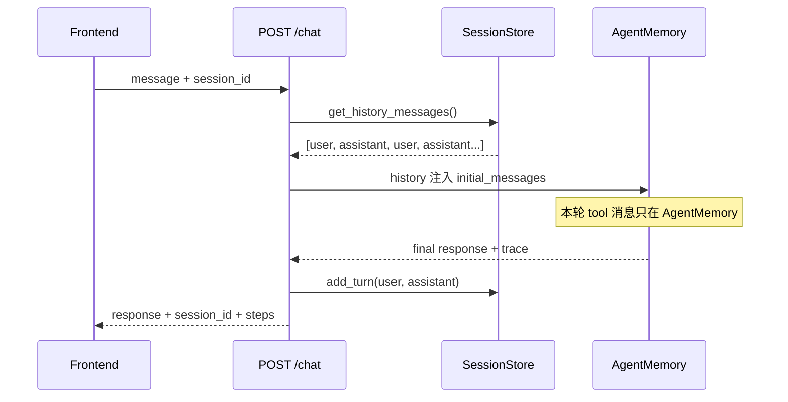

# 模块作用

**Memory（记忆）** 让 AI 助手能 **跨多轮对话** 理解上下文，而不是每问一句都「失忆」。

本项目里有 **三套记忆概念**，面试时必须分清楚：

| 类型 | 代码位置 | 生命周期 | 存什么 |
|------|----------|----------|--------|
| **Session Memory（短期会话记忆）** | `backend/memory/` | 跨多次 HTTP 请求 | 干净的 user + assistant 对话 |
| **Agent Memory（工作记忆）** | `backend/agent/memory.py` | 单次 `/chat` 请求内 | 完整 messages + ReAct trace |
| **Long-term Memory（长期记忆）** | `backend/memory/longterm_store.py` | 跨会话（占位） | 暂未实现 |

Session Memory 解决「用户上一句说了什么」；Agent Memory 解决「这一轮 Agent 调了哪些工具、看到了什么 Observation」。

# 核心原理

## 为什么 LLM 本身没有记忆

Chat Completion API 是 **无状态** 的：每次请求都要把完整 `messages` 列表传过去。所谓「记忆」，其实是应用层 **自己存历史、下次再拼进 Prompt**。

## 短期 vs 长期记忆

- **短期**：最近几轮原文对话，token 可控，实现简单
- **长期**：跨天、跨会话的摘要、用户偏好、重要事实，通常量更大，需要向量检索或数据库

## FIFO 截断

上下文窗口有限，不可能无限存。本项目 Session 用 **FIFO**：超过 `max_session_turns`（默认 10 轮）就删最早的轮次，保留最新的。

## 为什么不存 ReAct 中间步骤

Session 只存 **用户看到的最终回复**。如果把每步 Thought/Action/Observation 都存进 Session：

- token 爆炸
- 下一轮 LLM 可能被旧 tool 结果干扰
- 用户也不需要看内部推理链（trace 单独通过 API 返回）

# 项目中的实现方式

## Session Memory 数据结构

`backend/memory/types.py`：

```python
@dataclass
class ChatTurn:
    user: str
    assistant: str      # 最终回复，不是中间 Thought
    created_at: str

@dataclass
class Session:
    session_id: str
    turns: list[ChatTurn]
    long_term_hints: list[str]  # 预留长期记忆注入
```

## SessionStore 核心 API

`backend/memory/session_store.py`：

| 方法 | 作用 |
|------|------|
| `get_or_create(session_id)` | 无 ID 则 UUID 新建会话 |
| `get_history_messages(session_id)` | 转为 OpenAI messages 格式 |
| `add_turn(session_id, user, assistant)` | 追加一轮并 FIFO 截断 |
| `_trim(session)` | 保留最近 `max_session_turns` 轮 |

进程内单例：

```python
_store = SessionStore()

def get_session_store() -> SessionStore:
    return _store
```

**MVP 限制**：存在内存 `dict` 里，**服务重启即丢失**。注释建议生产换 Redis / SQLite。

## 谁在使用 SessionStore

| 调用方 | 流程 |
|--------|------|
| `api/chat.py` | load history → Agent → add_turn |
| `api/rag.py` | load history → rag_ask → add_turn |

Agent 和 RAG **共用同一套 Session**，同一个 `session_id` 下聊天和文档问答历史互通。

## Agent Memory（工作记忆）

`backend/agent/memory.py`：

```python
@dataclass
class AgentMemory:
    user_message: str
    messages: list[dict]   # system + history + user + assistant + tool ...
    trace: list[ReActStep]

@dataclass
class ReActStep:
    step: int
    thought: str
    action: str | None
    observation: str | None
    final_answer: str | None
```

关键方法：

- `append_assistant_message()` — LLM 返回后写入
- `append_tool_result(tool_call_id, content)` — Observation，`role=tool`
- `add_trace_step()` — 记录结构化 trace 供 API 返回

**生命周期**：`run_react_agent()` 开始时创建，结束时销毁；trace 通过 `ChatResponse.steps` 返回。

## Long-term Memory（占位）

`backend/memory/longterm_store.py`：

```python
class LongTermStore:
    def search(self, user_id: str, query: str) -> list[str]:
        return []  # 当前未实现
```

设计意图：未来检索用户偏好/摘要，注入 `Session.long_term_hints` 或单独 system 段，**不改 API 接口**。

## 前端 Session 持久化

`frontend/src/services/api.js`：

- `localStorage` key：`chat_session_id`
- 每次 `/chat` 响应后 `setSessionId(data.session_id)`
- 「新对话」按钮调用 `clearSessionId()` 清空

前端只存 **session_id**，不存消息内容；消息列表在 React state 里，刷新页面会清空 UI，但 session_id 还在。

# 数据流

## 多轮聊天



## history 注入格式

```
Session turns:
  Turn1: user="你好", assistant="你好！"
  Turn2: user="1+1?", assistant="2"

get_history_messages() →
  [
    {"role": "user", "content": "你好"},
    {"role": "assistant", "content": "你好！"},
    {"role": "user", "content": "1+1?"},
    {"role": "assistant", "content": "2"},
  ]
```

Agent 拼接：

```
[system REACT_PROMPT] + history + [user 当前消息]
```

## 新对话 vs 续聊

| 操作 | 前端 | 后端 |
|------|------|------|
| 续聊 | 带 localStorage 里的 session_id | 加载已有 turns |
| 新对话 | clearSessionId，不传 ID | UUID 新建空 Session |

# 面试题

> 每题提供两版回答：**30 秒版**适合开场快速应答，**2 分钟版**适合面试官追问「展开讲讲」。

## LLM 本身有记忆吗？你们怎么实现多轮对话？

### 简短回答（30秒版）

LLM API 是无状态的，每次都要传完整 messages。我们在 SessionStore 存历史，下次 `get_history_messages()` 拼进 Prompt，这就是「记忆」。

### 深入回答（2分钟版）

Chat Completion 不记住上次请求。`memory/session_store.py` 按 session_id 存 `ChatTurn`（user+assistant），API 层 load history 注入 `run_react_agent` 或 `rag_ask`。前端 localStorage 存 session_id 续聊。这是应用层 memory，不是模型权重里的记忆。Agent 单次运行内的 tool 消息在 AgentMemory，不进 Session。

## Session Memory 和 Agent Memory 有什么区别？

### 简短回答（30秒版）

Session 跨请求、只存干净问答，默认 10 轮 FIFO。Agent Memory 单次请求内、存完整 messages 和 ReAct trace，请求结束即销毁。

### 深入回答（2分钟版）

SessionStore：进程 dict，`/chat` 和 `/rag/ask` 共用，`add_turn` 只写最终 assistant 回复。AgentMemory：`loop.py` 创建，含 system/user/assistant/tool 全链，trace 供 steps API。前者服务用户多轮体验；后者服务当前 ReAct 推理。面试必考：两者 lifecycle 和内容不同，不能混。

## 为什么 Session 不存 ReAct 的 Thought/Action？

### 简短回答（30秒版）

费 token、可能干扰下一轮模型、用户也不需要看内部推理链。最终 assistant 回复已足够；调试看 trace，通过 API steps 返回，不进 Session。

### 深入回答（2分钟版）

若 Session 存每步 tool 消息，history 膨胀且可能把过时 Observation 带入新任务。设计选择：Session 是「用户可见对话」的压缩表示；ReAct 细节在 AgentMemory trace 和日志。前端 Execution Viewer 应用 steps 而非 replay Session。长期记忆若需要 tool 结论，应摘要进 assistant 文本而非 raw tool dump。

## max_session_turns 设 10 合理吗？怎么定？

### 简短回答（30秒版）

MVP 平衡上下文长度和成本。定法看模型 context 上限、平均轮次长度和业务需要，也可改成按 token 截断而非固定轮数。

### 深入回答（2分钟版）

`config.max_session_turns=10` 即最多 20 条 messages（user+assistant 交替）。`_trim` FIFO 删最早轮。定 10 是经验值：覆盖多数 follow-up，又不爆 context。调优：tiktoken 算总 token 超阈值再删；重要 system 记忆单独存 longterm；不同产品（客服 vs 编程）轮数不同。

## 服务重启后用户对话还在吗？

### 简短回答（30秒版）

不在。Session 在进程内存 dict，重启清空。FAISS 在磁盘不受影响。生产要用 Redis/SQLite 持久化 Session。

### 深入回答（2分钟版）

SessionStore 单例 `_sessions: dict[str, Session]`，无磁盘写入。uvicorn reload 或 deploy 后 session_id 虽在前端 localStorage，后端 get_or_create 得到空 Session。FaissVectorStore 从 `rag/store/` load 仍在。改进：`session_store.py` 换 Redis，key=session_id，value=JSON turns，TTL 7 天。

## 前端刷新页面后对话还在吗？

### 简短回答（30秒版）

UI 消息列表会空（React state），但 session_id 还在 localStorage。再发消息若后端未重启，能续后端 Session；前后端 UI 不同步是 MVP 问题。

### 深入回答（2分钟版）

ChatBox messages 仅内存，刷新丢失气泡。`getSessionId()` 仍带旧 ID 调 `/chat`，SessionStore 可能有 history 但前端不显示旧消息，用户以为新对话。改进：GET session messages API；或 localStorage 缓存展示层；或刷新时拉 history。steps trace 更不持久，未渲染 aside。

## FIFO 截断会丢失什么？有什么更好的策略？

### 简短回答（30秒版）

丢失最早几轮对话，模型不知道用户早期约束。更好策略：滑动窗口 + 对旧对话做摘要压缩成一条 system 记忆。

### 深入回答（2分钟版）

FIFO 简单但粗暴，如第 1 轮用户说「请用正式语气」第 11 轮后丢失。改进：ConversationSummaryBuffer 每 N 轮 LLM 摘要旧 turns；MemGPT 式分页换入；longterm_store 向量检索相关历史片段注入。本项目 `Session.long_term_hints` 字段预留但未 wired。

## 长期记忆一般怎么实现？

### 简短回答（30秒版）

定期把对话摘要 Embedding 存向量库，新会话按 query 检索相关摘要注入 Prompt。我们 LongTermStore 已留接口，当前返回空列表。

### 深入回答（2分钟版）

`longterm_store.py` 占位 `search(user_id, query) -> hints[]`。典型实现：每会话结束 summarize→embed→存 DB/向量库；新消息前 retrieve top hints→拼 system「用户偏好：...」。与 Session 短期 memory 互补：短期 raw turns，长期 compressed facts。接入点：API 层 load session 后 merge hints，不改 Agent 签名。

## `/chat` 和 `/rag/ask` 共用 Session 有什么好处和风险？

### 简短回答（30秒版）

好处：聊完文档还能接着问，上下文连续。风险：两路径行为不同（Agent vs 固定 RAG），需保证 add_turn 格式一致，避免 history 语义混乱。

### 深入回答（2分钟版）

共用 SessionStore 使同一 session_id 在 Agent 聊天和 RAG 问答间共享 user/assistant 历史。好处是 UX 统一。风险：RAG answer 和 Agent response 风格/长度不同，可能影响下一轮 Agent tool 决策；若一路径写错 turn 结构会破坏 messages。应统一 add_turn 只写最终文本，且文档说明两 API 混用时的预期行为。

## 如何防止用户 A 读到用户 B 的 session？

### 简短回答（30秒版）

session_id 用 UUID 够随机，但生产必须绑定 user_id + 鉴权，校验 session 归属，不能猜 ID 就读别人数据。

### 深入回答（2分钟版）

MVP 无 auth，知道 UUID 即可访问。生产：JWT 解析 user_id；SessionStore key 改为 `(user_id, session_id)`；get_or_create 验证归属否则 403。session_id 不应 sequential。敏感场景加 IP 绑定、session 过期、audit log。

## Agent trace 应该持久化吗？

### 简短回答（30秒版）

调试和审计有价值，可存 DB 或日志；不必放进 Session history。我们目前 API 返回 steps，前端未展示，也未落库。

### 深入回答（2分钟版）

trace 含 thought/action/observation，适合 ops 排查「为何调错工具」。持久化：异步写 ClickHouse/ES，关联 session_id+timestamp。不应作为下一轮 LLM context 默认输入。合规场景可能需脱敏 user message。前端 Execution Viewer 可只读最近一条 trace 不必全历史存。

## 记忆太长导致超 context 怎么办？

### 简短回答（30秒版）

减少 max_turns、摘要旧对话、检索式 memory 只注入相关轮、换更长 context 的模型。

### 深入回答（2分钟版）

多层策略：Session FIFO 已限 10 轮；RAG Top-K 限资料长；Agent max_steps 限 tool 消息。进一步：token counter 超 8k 触发 summary；longterm 只 retrieve 相关 3 条 hint；system prompt 精简。监控 prompt token 分布调 config。glm-4 等长窗口模型是兜底，不是替代 memory 管理。

# 容易踩坑的问题

1. **以为 localStorage 存了对话**：只存 session_id，不存 messages。
2. **后端重启 + 前端旧 session_id**：后端空 Session，表现像「失忆」，但前端还显示旧 session 前缀。
3. **混淆 trace 和 history**：把 steps 当 history 喂回去会格式错乱。
4. **Session 与 Agent 不同步**：Agent 内多轮 tool 不会写入 Session，只有最终 response 写入。
5. **long_term_hints 未 wired**：字段存在但未使用，面试不要说「已实现长期记忆」。

# 进阶知识

- **Conversation Summary Buffer**：LangChain 式自动摘要
- **MemGPT / 分层 memory**：主上下文 + 外部存储分页换入
- **Zep / Mem0**：开源长期记忆框架
- **按 token 截断**：tiktoken 精确控 window
- **Redis Session + TTL**：自动过期会话

**相关文档**：[react-agent.md](./react-agent.md) · [architecture.md](./architecture.md) · [frontend.md](./frontend.md)
