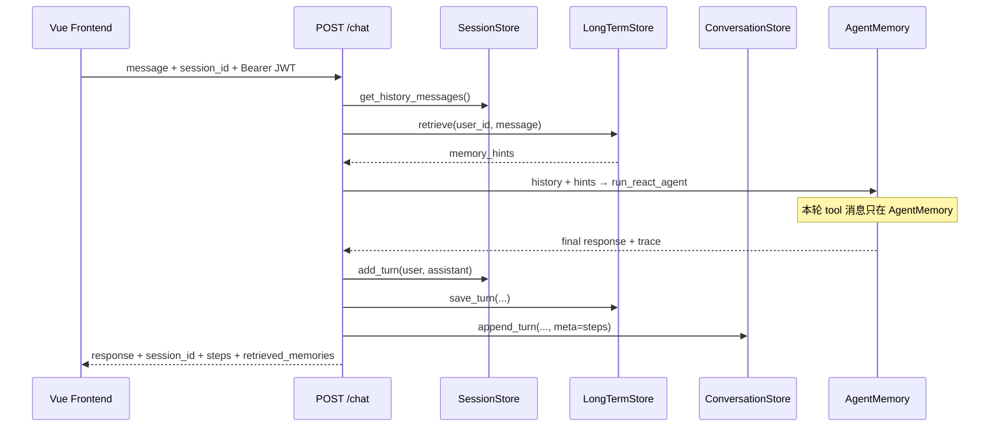

> **面试以代码为准，文档当复习提纲。** 若与仓库实现不一致，以 `backend/memory/`、`backend/conversation/`、`backend/api/chat.py` 源码为准。

# 模块作用

**Memory（记忆）** 让 AI 助手能 **跨多轮、跨会话** 理解上下文，而不是每问一句都「失忆」。

本项目里有 **四套相关概念**，面试时必须分清楚：

| 类型 | 代码位置 | 生命周期 | 存什么 |
|------|----------|----------|--------|
| **Session Memory（短期会话记忆）** | `backend/memory/session_store.py` | 跨多次 HTTP 请求（SQLite 持久化） | 干净的 user + assistant 对话，供 Agent/RAG 注入 |
| **Agent Memory（工作记忆）** | `backend/agent/memory.py` | 单次 `/chat` 请求内 | 完整 messages + ReAct trace |
| **Long-term Memory（长期记忆）** | `backend/memory/longterm_store.py` 等 | 跨会话（FAISS 持久化） | 经 extractor 筛选的语义事实，向量检索后注入 Prompt |
| **Conversation Store（UI 对话持久化）** | `backend/conversation/store.py` | 跨请求/刷新（SQLite） | 完整消息列表、标题、assistant meta（steps、memories） |

Session 解决「本轮 Agent 需要最近几轮 history」；Long-term 解决「上周说过的重要偏好/事实」；Conversation 解决「侧边栏列表和刷新后恢复聊天气泡」；Agent Memory 解决「这一轮 ReAct 调了哪些工具」。

# 核心原理

## 为什么 LLM 本身没有记忆

Chat Completion API 是 **无状态** 的：每次请求都要把完整 `messages` 列表传过去。所谓「记忆」，其实是应用层 **自己存历史、检索相关事实、下次再拼进 Prompt**。

## 短期 vs 长期 vs UI 持久化

- **短期（Session）**：最近 N 轮原文对话，token 可控，FIFO 截断
- **长期（LongTerm）**：跨天、跨会话的摘要/偏好/事实，向量检索 Top-K 注入 `memory_hints`
- **UI（Conversation）**：不截断的完整往返记录，含 trace meta，与 Agent 注入用的 Session 职责分离

## FIFO 截断

上下文窗口有限，Session 不可能无限存。超过 `max_session_turns`（默认 10 轮 = 20 条 messages）就删最早的轮次。**Conversation SQLite 不受此 FIFO 影响**，仍保留完整 UI 历史。

## 为什么不存 ReAct 中间步骤进 Session

Session 只存 **用户看到的最终回复**。如果把每步 Thought/Action/Observation 都存进 Session：

- token 爆炸
- 下一轮 LLM 可能被旧 tool 结果干扰
- 用户也不需要看内部推理链（trace 通过 API `steps` 和 Conversation `meta` 返回）

# 项目中的实现方式

## 1. Session Memory

### 数据结构

`backend/memory/types.py`：

```python
@dataclass
class ChatTurn:
    user: str
    assistant: str      # 最终回复，不是中间 Thought
    created_at: str

@dataclass
class Session:
    session_id: str
    user_id: str
    turns: list[ChatTurn]
    long_term_hints: list[str]  # 预留字段；实际 hints 由 retrieve 动态注入
```

### SessionStore 核心 API

`backend/memory/session_store.py`（**SQLite** `data/sessions.db`，按 `user_id` 隔离）：

| 方法 | 作用 |
|------|------|
| `get_or_create(session_id, user_id)` | 无 ID 则 UUID；存在则校验归属 |
| `get_history_messages(session_id)` | 转为 OpenAI messages 格式 |
| `add_turn(session_id, user, assistant)` | 追加一轮并 FIFO 截断 |
| `get_short_term_items(session_id)` | Memory 面板用的字符串列表 |
| `_trim(session)` | 保留最近 `max_session_turns` 轮 |

越权访问抛出 `SessionForbiddenError` → API 返回 403。

### 谁在使用 SessionStore

| 调用方 | 流程 |
|--------|------|
| `api/chat.py` | load history → retrieve longterm → Agent → add_turn + save_turn |
| `api/rag.py` | load history → rag_ask → add_turn |
| `api/memory.py` | load history → memory_ask → add_turn + save_turn |

Agent 和 RAG **共用同一套 Session**（同一 `session_id` 下历史互通）。

## 2. Agent Memory（工作记忆）

`backend/agent/memory.py`：

```python
@dataclass
class AgentMemory:
    user_message: str
    messages: list[dict]   # system + history + user + assistant + tool ...
    trace: list[ReActStep]
```

关键方法：

- `append_assistant_message()` — LLM 返回后写入
- `append_tool_result(tool_call_id, content)` — Observation，`role=tool`
- `add_trace_step()` — 记录结构化 trace 供 API 返回

**生命周期**：`run_react_agent()` / `run_react_agent_stream()` 开始时创建，结束时销毁；trace 通过 `ChatResponse.steps` 返回，并可写入 Conversation assistant `meta`。

## 3. Long-term Memory（已实现）

`backend/memory/longterm_store.py` 是对外门面：

```python
class LongTermStore:
    def retrieve(self, user_id, query) -> MemoryRetrievalResult  # FAISS Top-K + hints
    def save_turn(self, user_message, assistant_message, *, user_id, session_id) -> ExtractionResult
    def search(self, user_id, query) -> list[str]  # 兼容简写
```

完整链路：

| 阶段 | 模块 | 说明 |
|------|------|------|
| 检索 | `memory/chain.py` | `should_retrieve_memory` → embed → `MemoryVectorStore.search` → hints |
| 入库 | `memory/ingester.py` | `extractor` 打分 → embed → FAISS 写入 |
| 存储路径 | `settings.memory_store_path` | 默认 `memory/store/{user_id}/`，与 RAG 分离 |
| HTTP | `api/chat.py` | 请求前 `_retrieve_longterm_memory`，请求后 `_save_longterm_memory` |
| HTTP | `api/memory.py` | `GET /memory` 概览；`/memory/ask` 独立问答链路 |

配置项（`core/config.py`）：`memory_top_k`、`memory_min_score`（入库阈值）、`memory_dedup_threshold`（语义去重）、`memory_min_retrieval_score`（注入阈值）。

**不是占位**：`retrieve` 返回真实 Top-K；`save_turn` 经 extractor 筛选后写入 FAISS。

## 4. Conversation Store（UI 持久化）

`backend/conversation/store.py`（SQLite `data/conversations.db`）：

- **`conversation_id === session_id`**（同一 UUID）
- 表：`conversations`（元数据）+ `conversation_messages`（role/content/meta_json）
- `append_turn` 存 user + assistant；assistant `meta` 含 `steps`、`retrieved_memories` 等
- 首条用户消息自动生成标题
- API：`api/conversations.py` CRUD；`api/chat.py` 每轮结束后 `_persist_conversation_turn`

与 Session 的区别：Conversation 为 **完整 UI 历史 + 侧边栏**；Session 为 **Agent 注入用的最近 N 轮**。

## 前端持久化与恢复（Vue 3）

`frontend/src/services/api.js` + `ChatPage.vue`：

- `localStorage`：`auth_token`、`chat_session_id`（= conversation_id）
- `onMounted`：`fetchConversations()` 填侧边栏；若有 sessionId 则 `fetchConversation(id)` **恢复消息气泡**
- 流式：`chatStreamAPI` + AbortSignal 停止生成
- Memory 面板：`fetchMemoryOverview(sessionId)` → `GET /memory`

刷新页面：**Vue 组件 state 会清空**，但可从 Conversation API 拉完整 history；Session/LongTerm 在后端 SQLite/FAISS 中仍在。

# 数据流

## 多轮聊天（含长期记忆）



## history 注入格式

```
Session turns:
  Turn1: user="你好", assistant="你好！"
  Turn2: user="1+1?", assistant="2"

get_history_messages() →
  [
    {"role": "user", "content": "你好"},
    {"role": "assistant", "content": "你好！"},
    {"role": "user", "content": "1+1?"},
    {"role": "assistant", "content": "2"},
  ]

Agent 拼接：
  [system REACT_PROMPT] + [memory_hints 段] + history + [user 当前消息]
```

## 新对话 vs 续聊

| 操作 | 前端 | 后端 |
|------|------|------|
| 续聊 | 带 localStorage 的 session_id | Session SQLite 加载 turns；Conversation 可 GET 详情 |
| 新对话 | `createConversationAPI` 或 clearSessionId | 新 UUID；空 Session + 新 Conversation 行 |
| 切换历史 | 侧边栏选 conversation → `restoreConversation` | GET `/conversations/{id}` 填 UI |

# 面试题

> 每题提供两版回答：**30 秒版**适合开场快速应答，**2 分钟版**适合面试官追问「展开讲讲」。

## LLM 本身有记忆吗？你们怎么实现多轮对话？

### 简短回答（30秒版）

LLM API 是无状态的，每次都要传完整 messages。我们在 SessionStore 存最近 N 轮，LongTermStore 向量检索跨会话 facts，拼进 Prompt，这就是「记忆」。

### 深入回答（2分钟版）

Chat Completion 不记住上次请求。`memory/session_store.py` 按 `(session_id, user_id)` 存 `ChatTurn`，API 层 `get_history_messages` 注入 `run_react_agent`。长期记忆在请求前 `LongTermStore.retrieve` 得到 hints 写入 system 段。前端 Vue 用 Conversation API 恢复 UI。Agent 单次运行内的 tool 消息在 AgentMemory，不进 Session。

## Session Memory 和 Agent Memory 有什么区别？

### 简短回答（30秒版）

Session 跨请求、只存干净问答，FIFO 默认 10 轮，SQLite 持久化。Agent Memory 单次请求内、存完整 messages 和 ReAct trace，请求结束即销毁。

### 深入回答（2分钟版）

SessionStore：`/chat`、`/rag/ask`、`/memory/ask` 共用，`add_turn` 只写最终 assistant 回复，超轮数 FIFO 截断。AgentMemory：`loop.py` 创建，含 system/user/assistant/tool 全链，trace 供 steps API 和 Conversation meta。前者服务多轮用户体验与 LLM context；后者服务当前 ReAct 推理。lifecycle 和内容不同，不能混。

## Conversation Store 和 Session 有什么不同？为什么要两套？

### 简短回答（30秒版）

同一 UUID，但职责不同：Session 只保留最近 N 轮给 Agent 注入；Conversation 存完整 UI 历史、标题和 trace meta，刷新后 Vue 从 GET `/conversations/{id}` 恢复。

### 深入回答（2分钟版）

`conversation_id === session_id` 降低前端心智负担。Session FIFO 控制 token；Conversation 不截断，assistant meta 存 steps/retrieved_memories 供 Debug Inspector。`api/chat.py` 每轮同时写两者。若只用一个 store，要么 UI 历史被 FIFO 删掉，要么 Agent 吃下过多 token。分离是常见的「注入用压缩历史 + 展示用完整日志」模式。

## 为什么 Session 不存 ReAct 的 Thought/Action？

### 简短回答（30秒版）

费 token、可能干扰下一轮模型、用户也不需要看内部推理链。最终 assistant 回复已足够；调试看 trace，通过 API steps 和 Conversation meta 返回，不进 Session history。

### 深入回答（2分钟版）

若 Session 存每步 tool 消息，history 膨胀且可能把过时 Observation 带入新任务。设计选择：Session 是「用户可见对话」的压缩表示；ReAct 细节在 AgentMemory trace、Conversation assistant meta 和日志。Vue Execution Viewer 读 steps/meta 而非 replay Session。长期记忆若需要 tool 结论，应经 extractor 摘要进 FAISS，而非 raw tool dump。

## max_session_turns 设 10 合理吗？怎么定？

### 简短回答（30秒版）

平衡上下文长度和成本。定法看模型 context 上限、平均轮次长度和业务需要，也可改成按 token 截断而非固定轮数。

### 深入回答（2分钟版）

`config.max_session_turns=10` 即最多 20 条 messages（user+assistant 交替）。`_trim` FIFO 删最早轮。定 10 是经验值：覆盖多数 follow-up，又不爆 context。Conversation 仍保留完整 UI 记录。调优：tiktoken 算总 token 超阈值再删；重要事实靠 longterm FAISS；不同产品轮数不同。

## 服务重启后用户对话还在吗？

### 简短回答（30秒版）

Session 和 Conversation 都在 SQLite，重启后仍在。LongTerm 在 FAISS 磁盘也在。多实例部署时各副本 SQLite/FAISS 不自动同步才是问题。

### 深入回答（2分钟版）

SessionStore 写 `data/sessions.db`，ConversationStore 写 `data/conversations.db`，LongTerm 写 `memory/store/{user_id}/`。单实例 uvicorn reload 后，同一 session_id 仍能 `get_history_messages`。前端 localStorage 的 session_id 有效。生产多副本需 Redis/Postgres + 共享对象存储上的向量索引，否则各 pod 数据不一致。

## 前端刷新页面后对话还在吗？

### 简短回答（30秒版）

Vue 组件 state 会空，但 `ChatPage` 在 onMounted 用 session_id 调 `fetchConversation` 恢复气泡。localStorage 还存 auth_token 和 session_id。

### 深入回答（2分钟版）

消息列表存在 Vue ref，刷新丢失。`ChatPage.vue` mounted 时 `refreshConversations()` 填侧边栏，若有 `getSessionId()` 则 `restoreConversation(id, { silent: true })` 从 SQLite 拉 messages。Session 后端 history 与 UI 重新对齐。未选中的旧对话可从侧边栏点击加载。steps 存在 assistant meta，可选中消息后在 Inspector 查看。

## 长期记忆是怎么实现的？还说它是占位吗？

### 简短回答（30秒版）

已实现。`LongTermStore.retrieve/save_turn` 走 FAISS：`chain.py` 检索 Top-K hints 注入 Agent；`ingester.py` + `extractor` 筛选后入库。`/chat` 和 `/memory/ask` 都已 wired。

### 深入回答（2分钟版）

存储：`memory/store/{user_id}/` 独立 FAISS，与 RAG 分离。检索：`should_retrieve_memory` 判断 → embed query → Top-K → 加权过滤 → hints 字符串列表。入库：每轮 chat 后 `save_turn`，extractor 启发式打分 + 语义去重，达标才 embed 写入。配置：`memory_top_k`、`memory_min_score`、`memory_dedup_threshold`。API 返回 `retrieved_memories` 和 `memories_used` 便于前端展示。**不要说「未实现长期记忆」**。

## FIFO 截断会丢失什么？有什么更好的策略？

### 简短回答（30秒版）

丢失 Session 里最早几轮，模型不知道用户早期约束。Conversation 仍保留完整 UI。更好策略：滑动窗口 + 摘要压缩 + longterm 向量检索相关片段。

### 深入回答（2分钟版）

FIFO 简单但粗暴，如第 1 轮「请用正式语气」在第 11 轮 Session 注入时丢失。缓解：LongTerm 已在 `/chat` 前 retrieve 相关 facts；Conversation 供用户回看；可再加 ConversationSummaryBuffer 把旧 turns 摘要成一条。`Session.long_term_hints` 字段预留但 hints 现由 retrieve 动态生成，不依赖该字段持久化。

## `/chat` 和 `/rag/ask` 共用 Session 有什么好处和风险？

### 简短回答（30秒版）

好处：聊完文档还能接着问，上下文连续。风险：两路径行为不同（Agent vs 固定 RAG），需保证 add_turn 格式一致，避免 history 语义混乱。

### 深入回答（2分钟版）

共用 SessionStore 使同一 session_id 在 Agent 聊天和 RAG 问答间共享 user/assistant 历史。好处是 UX 统一。风险：RAG answer 和 Agent response 风格/长度不同，可能影响下一轮 Agent tool 决策；若一路径写错 turn 结构会破坏 messages。应统一 add_turn 只写最终文本。LongTerm save_turn 在 `/chat` 和 `/memory/ask` 也会写，RAG 路径目前只 add_turn Session。

## 如何防止用户 A 读到用户 B 的 session？

### 简短回答（30秒版）

已实现鉴权：`get_current_user` 解析 user_id；SessionStore 和 ConversationStore 校验归属，越权 403。向量库按 user_id 分目录。生产要关 auth_disabled。

### 深入回答（2分钟版）

JWT / API Key / 开发模式 X-User-Id 确定身份。`get_or_create(session_id, user_id)` 若 session 存在但 owner 不同则 `SessionForbiddenError`。Conversation `get_owned` 同理。Memory/RAG FAISS 路径含 user_id。不能仅靠 UUID 随机性——必须绑定 user_id。生产还需 HTTPS、rate limit、审计日志；默认 `auth_disabled=True` 仅适合本地。

## Agent trace 应该持久化吗？

### 简短回答（30秒版）

调试和审计有价值。我们存在 Conversation assistant meta 的 `steps` 里，不进 Session history。前端 Inspector 可读，未单独建 trace 表。

### 深入回答（2分钟版）

trace 含 thought/action/observation，适合 ops 排查。当前：API 返回 steps；流式 done 事件带 steps；`_persist_conversation_turn` 写入 meta。不应作为下一轮 LLM context 默认输入。大规模场景可异步写 ClickHouse/ES。合规场景可能需脱敏 user message。

## 记忆太长导致超 context 怎么办？

### 简短回答（30秒版）

Session FIFO 限轮数、LongTerm 只注入 Top-K 相关 hints、RAG Top-K 限资料长、Agent max_steps 限 tool 消息。还可按 token 截断或换长窗口模型。

### 深入回答（2分钟版）

多层策略：Session `_trim` 限 10 轮；retrieve 有 `memory_min_retrieval_score` 过滤低分记忆；RAG `retrieval_top_k` 限 chunk；Agent `max_agent_steps` 限 tool 轮数。进一步：tiktoken 监控总 prompt token；extractor 只存高价值 facts 进 FAISS；system prompt 精简。glm-4 等长窗口是兜底，不是替代 memory 管理。

## 停止生成时记忆会怎么保存？

### 简短回答（30秒版）

流式取消时若有 partial 回复，仍会 `add_turn` 到 Session、save_turn 到 LongTerm、append 到 Conversation，和正常 done 类似。

### 深入回答（2分钟版）

`api/chat.py` 捕获 `AgentCancelledError`，取 partial_response，非空则三路持久化并返回 `cancelled` SSE 事件。这样用户停止后下一轮仍能接上 partial  assistant 内容。Memory/RAG 流式路径同理处理 partial answer。

# 容易踩坑的问题

1. **以为 localStorage 存了对话内容**：只存 `session_id` 和 token，messages 靠 Conversation API 或内存 state。
2. **混淆四套存储**：Session（Agent 注入 FIFO）、Conversation（UI 全量）、LongTerm（FAISS  facts）、AgentMemory（单次 trace）。
3. **混淆 trace 和 history**：把 steps 当 history 喂回去会格式错乱。
4. **Session 与 Agent 不同步**：Agent 内多轮 tool 不会写入 Session，只有最终 response 写入。
5. **说长期记忆未实现**：代码已 wired retrieve/save_turn，面试应描述 FAISS + extractor 链路。
6. **auth_disabled 下误以为无多用户**：仍有 `user_id` 隔离，应用 X-User-Id 测多租户。
7. **FIFO 删掉的轮次**：UI 仍可在 Conversation 看到，但 Agent 下一轮不再注入。

# 进阶知识

- **Conversation Summary Buffer**：LangChain 式自动摘要旧 Session turns
- **MemGPT / 分层 memory**：主上下文 + 外部存储分页换入
- **Zep / Mem0**：开源长期记忆框架；本项目是自研 extractor + FAISS
- **按 token 截断**：tiktoken 精确控 window
- **Redis Session + TTL**：多副本场景替代本地 SQLite

**相关文档**：[react-agent.md](./react-agent.md) · [architecture.md](./architecture.md) · [backend.md](./backend.md) · [frontend.md](./frontend.md)
