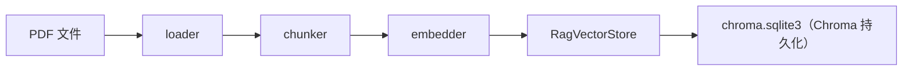

# 模块作用

**RAG（Retrieval-Augmented Generation，检索增强生成）** 解决 LLM **不知道你私有数据** 的问题。

本项目中 RAG 让你可以：

1. 上传 PDF（如员工手册）到知识库
2. 用户提问时，先检索最相关的文档片段
3. 把片段塞进 Prompt，让 LLM **基于资料** 回答，而不是编造

代码在 `backend/rag/`，有两条使用路径：

- **独立 API**：`POST /rag/ask` → `rag/chain.py`
- **Agent 工具**：`search_docs` → 只负责检索，由 Agent 组织答案

# 核心原理

## 为什么需要 RAG

LLM 训练数据有 cutoff，且不含公司内部 PDF。Fine-tune 成本高。RAG 在推理时 **临时** 把相关知识贴进 Prompt，便宜、可更新。

## RAG 四步（经典）

```
Indexing（离线）: 文档 → 切 chunk → Embedding → 存向量库
Retrieval（在线）: 问题 → Embedding → 相似度搜索 Top-K
Augmentation: 把 chunk 拼进 Prompt
Generation: LLM 读 Prompt 生成答案
```

## Chunk 为什么重要

整篇 PDF 塞不进 context window。切成 500 字左右小块，检索更精准；overlap 50 字避免句子被截断断义。

# 项目中的实现方式

## 目录与职责

| 文件 | 职责 |
|------|------|
| `loader.py` | PDF/文本加载（pypdf） |
| `chunker.py` | 滑动窗口切分，默认 500/50 |
| `embedder.py` | 调用 Embedding API |
| `ingest.py` | 入库流水线 orchestration |
| `vectorstore.py` | Chroma 存取（见 chroma.md） |
| `retriever.py` | `search_similar()` |
| `prompt_builder.py` | RAG system prompt + context 格式化 |
| `chain.py` | `rag_ask()` 完整 6 步 |
| `types.py` | PageText, TextChunk, SearchResult 等 |

## 入库流程

`ingest.py`：

```
PDF → load_pdf() → ExtractedDocument
    → chunk_document() → TextChunk[]
    → embed_chunks() → EmbeddedChunk[]
    → RagVectorStore.add_embeddings() + save()
```

HTTP 入口：

- `POST /documents/upload` — 上传 PDF
- `POST /rag/ingest` — JSON 纯文本

## 问答流程 rag_ask

`chain.py` 六步（文件头注释）：

```53:151:backend/rag/chain.py
def rag_ask(question, store=None, top_k=None, history=None) -> RAGResult:
    // Step 1: 接收问题
    // Step 2-3: embed + Chroma search → sources
    // Step 5: build_rag_messages()
    // Step 6: chat_completion(messages, tools=None)
```

空库时抛：`向量库为空，请先入库文档`

## Prompt 策略

`prompt_builder.py`：

- **System**：仅根据提供的参考资料回答；资料没有则明确说不知道；禁止编造
- **User**：拼接 `[资料]` + `[问题]`
- 支持注入 Session `history` 做多轮 RAG

## 与 Agent 路径的差异

| 维度 | `/rag/ask` | Agent + search_docs |
|------|------------|---------------------|
| 谁生成答案 | `rag_ask` 固定 Prompt | Agent 多轮 ReAct |
| 检索 | retriever | 同一 retriever |
| 能否用 calculator | 否 | 能 |
| 返回 sources | API 结构化 | 仅在 trace/日志 |

## Demo 脚本

教学用 CLI：

- `python -m rag.demo_rag --ingest`
- `python -m scripts.demos.demo_chroma`
- `python -m rag.demo_embedding`
- `python -m rag.demo_pdf_chunk`

# 数据流

## 离线索引



## 在线问答

```
用户 question
  → embed_text(question)           # Step 2
  → vectorstore.search(vec, top_k) # Step 3
  → SearchResult[]                 # Step 4
  → build_rag_messages()           # Step 5
  → chat_completion()              # Step 6
  → RAGResult(answer, sources, context)
```

## Session 叠加

```
POST /rag/ask + session_id
  → SessionStore.get_history_messages()
  → rag_ask(..., history=history)
  → SessionStore.add_turn(question, answer)
```

# 面试题

> 每题提供两版回答：**30 秒版**适合开场快速应答，**2 分钟版**适合面试官追问「展开讲讲」。

## 什么是 RAG？解决什么问题？

### 简短回答（30秒版）

RAG 就是检索增强生成：先查知识库，再让大模型带着查到的片段回答。它解决的是 LLM 不知道你私有数据、容易瞎编的问题。比如员工手册 PDF，不用微调模型，上传就能问。

### 深入回答（2分钟版）

RAG 把「Indexing → Retrieval → Augmentation → Generation」四步串起来：离线把文档切块、向量化存 Chroma，在线把问题 embed 后检索 Top-K，再拼进 Prompt 让 LLM 生成。本项目 `backend/rag/` 实现两条路径：`POST /rag/ask` 走 `chain.py` 的 `rag_ask()` 完整六步；Agent 则通过 `search_docs` 只检索、由 ReAct 循环组织答案。相比 Fine-tune，知识可热更新、回答可溯源（返回 `sources` 含页码），适合企业文档 QA 这类 MVP 场景。

## 你们的 RAG pipeline 分几步？对应哪些文件？

### 简短回答（30秒版）

分两条线：离线索引和在线问答。入库是 load → chunk → embed → 存 Chroma；问答是 embed 问题 → 检索 → 拼 Prompt → 调 LLM。核心编排分别在 `ingest.py` 和 `chain.py`。

### 深入回答（2分钟版）

**离线索引**（`ingest.py`）：PDF 经 `loader.py` 的 `load_pdf()` 得到 `ExtractedDocument`，`chunker.py` 的 `chunk_document()` 切成 `TextChunk[]`，`embedder.py` 的 `embed_chunks()` 向量化，`vectorstore.py` 的 `RagVectorStore.add_embeddings()` 写入并 save。HTTP 入口是 `POST /documents/upload` 和 `POST /rag/ingest`。**在线问答**（`chain.py` 六步）：Step 1 接收问题 → Step 2-3 `retriever.py` 的 `search_similar()`（embed + Chroma Top-K）→ Step 5 `prompt_builder.py` 的 `build_rag_messages()` → Step 6 `chat_completion()` 无 tools 生成答案，返回 `RAGResult`（含 answer、sources、context）。

## chunk_size 和 chunk_overlap 怎么选？

### 简短回答（30秒版）

我们默认 500 字符、overlap 50，大约 10% 重叠。块太小语义不完整，太大检索不精准。中文文档一般 400～600 字起步，overlap 取 chunk_size 的 10%～20%，先跑通再按召回效果调。

### 深入回答（2分钟版）

`chunker.py` 采用逐页滑动窗口：`chunk_size=500` 控制每块最大字符数，`chunk_overlap=50` 让相邻块共享边界文字，避免句子被拦腰截断。模块注释里的 CHUNK_SIZE_GUIDE 给了分场景参考——FAQ 用 200～400，技术文档可到 800～1200。原则是先 500/50 跑 demo（`demo_pdf_chunk.py`），观察检索命中是否截断关键句，再微调。注意 overlap 必须小于 chunk_size，否则 `chunk_document()` 会抛 `ValueError`。

## 为什么用字符数切分而不是 token？

### 简短回答（30秒版）

字符切分实现简单，教学 demo 够用，不依赖 tokenizer。缺点是不同模型 token 预算不好精确控制。生产环境通常用 tiktoken 按 token 切，才能严格对齐 embedding 和 LLM 的 context 上限。

### 深入回答（2分钟版）

本项目 `chunker.py` 用 Python 字符串长度做滑动窗口，`_chunk_single_page()` 直接 `text[start:end]` 切分，零依赖、逻辑透明，适合 `demo_pdf_chunk.py` 教学。`config.py` 注释也写明 `rag_chunk_size` 是字符数而非 token。但 embedding API 和 LLM 都按 token 计费，中文 1 字约 1～2 token，500 字符可能接近 500～1000 token，和模型 context 窗口的对应关系不精确。上生产应改用 tiktoken 或模型自带 tokenizer，确保「切块 + Top-K 拼接 + history」总 token 不超限。

## Top-K 设 3 合理吗？太大太小会怎样？

### 简短回答（30秒版）

3 对 MVP 文档 QA 是个常见起点，能覆盖大多数单点问题。K 太小容易漏掉分散在多段的关键信息；K 太大则噪音多、Prompt 变长、费 token 还可能干扰 LLM。我们 config 默认 3，API 可传 `top_k` 覆盖。

### 深入回答（2分钟版）

`config.py` 的 `retrieval_top_k=3`，`retriever.py` 的 `search_similar()` 取 `top_k or settings.retrieval_top_k`，`POST /rag/ask` 也支持请求体传 `top_k`。K=3 时，3 个 500 字 chunk 约 1500 字上下文，对 gpt-4o-mini 足够且成本低。K=1 可能漏掉跨段答案（如流程分三步写）；K=10 会把低分无关 chunk 塞进 `format_context()`，增加幻觉风险。调参建议：看 `RAGResult.sources` 的 score 分布，若 Top-3 分数接近且都相关可维持；若第 3 名明显偏低，考虑加 reranker 而非单纯增大 K。

## RAG 和 Fine-tuning 怎么选？

### 简短回答（30秒版）

RAG 适合知识频繁更新、需要引用出处的场景，改文档重新入库就行。Fine-tune 适合固化行为风格或领域语气，但知识更新成本高。实际项目常组合：RAG 供事实，Fine-tune 调交互风格。

### 深入回答（2分钟版）

本项目选 RAG 而非 Fine-tune 的原因很典型：员工手册等 PDF 可随时上传（`ingest.py`），问答返回 `sources` 含 `source` 和 `page` 便于核对，无需重训模型。Fine-tune 适合让模型学会特定输出格式或行业术语，但知识 cutoff 后更新要重新训练。我们的架构文档也提到 LLM 训练数据不含公司内部 PDF，RAG 在推理时临时注入上下文，便宜且可更新。若未来要统一客服语气，可在 RAG 检索之上叠一层轻量 Fine-tune 或更强的 system prompt，而非二选一。

## 如何减少 RAG 幻觉（模型瞎编）？

### 简短回答（30秒版）

核心是约束模型「只许看资料说话」。我们在 system prompt 里写死「仅根据资料回答、资料没有就说不知道」。另外返回 sources 方便人工核对，检索为空时不应硬编答案。

### 深入回答（2分钟版）

`prompt_builder.py` 的 `RAG_SYSTEM_PROMPT` 四条规则：只用资料信息、无相关内容明确说「未找到」、可引用页码、禁止编造。`build_rag_messages()` 把 Top-K chunk 带来源和相似度分数拼进 user 消息，LLM 有明确证据链。`chain.py` 的 `rag_ask()` 调用 `chat_completion(messages, tools=None)`，不走 Agent 工具链，减少模型「自由发挥」空间。API 返回结构化 `sources` 供前端展示引用。进阶还可加：低 temperature、reranker 二次排序、faithfulness 校验（答案是否被 chunk 支持）。

## 检索不到相关内容时怎么办？

### 简短回答（30秒版）

检索结果为空或分数很低时，应该让模型明确说「不知道」，而不是硬编。我们 `format_context()` 会写「未检索到任何相关文档片段」，system prompt 也要求如实告知。Agent 路径下 `search_docs` 直接返回「未找到相关片段」。

### 深入回答（2分钟版）

`retriever.py` 的 Chroma 搜索即使命中也会返回结果，但可能是低相关 chunk；`format_context()` 在 `sources` 为空时返回「（未检索到任何相关文档片段）」并打 warning 日志。`RAG_SYSTEM_PROMPT` 第 2 条要求模型回答「根据现有文档，未找到相关信息」。`search_docs.py` 的 `format_search_results()` 空结果时返回「未在知识库中找到相关文档片段」，Agent 据此决定是否换 query 或告知用户。向量库为空时，`chain.py` 直接抛 `ValueError("向量库为空，请先入库文档")`，`search_docs` 则提示先上传 PDF。不应在空 context 下让 LLM 猜测。

## Agent 里的 search_docs 和 rag_ask 有什么区别？

### 简短回答（30秒版）

`search_docs` 只负责检索，把 chunk 文本返回给 Agent，由 ReAct 循环决定怎么回答、是否调其他工具。`rag_ask` 是一条龙：检索 + 固定 Prompt + 直接调 LLM 生成答案，路径更短、引用格式统一。

### 深入回答（2分钟版）

两者共用 `retriever.py` 的 `search_similar()` 和同一个 Chroma 索引。`search_docs.py` 的 `run_search_docs()` 格式化 Observation 给 Agent（含 rank、source、page、score），Agent 可组合 calculator 等工具做多步推理。`chain.py` 的 `rag_ask()` 检索后走 `build_rag_messages()` 固定模板，一次 `chat_completion` 出答案，返回 `RAGResult` 含结构化 sources。对比：Agent 路径灵活但 trace 复杂；`/rag/ask` 路径短、适合纯文档 QA 前端。`search_docs` 用 config 的 `retrieval_top_k`，`rag_ask` 还可通过 API 传 `top_k` 覆盖。

## 多轮对话 RAG 要注意什么？

### 简短回答（30秒版）

多轮时要把 Session 历史注入 Prompt，但每轮都应重新检索，因为新问题可能指向不同文档段落。另外 history 太长会占 token，我们 config 里 `max_session_turns=10` 控制轮数上限。

### 深入回答（2分钟版）

`api/rag.py` 的 `/rag/ask` 通过 `SessionStore` 加载 `history`，传给 `rag_ask(..., history=history)`，答完后 `add_turn` 保存。`build_rag_messages()` 结构是 system → history → 当前 user（含本轮检索资料 + 问题），即 **每轮都重新 embed 和 Chroma 检索**，不会复用上一轮 chunk。这避免了「上一轮资料已过时但仍被引用」的问题。注意 history 和 Top-K context 叠加会快速消耗 context window，`config.py` 的 `max_session_turns=10` 限制短期记忆轮数。追问场景（「刚才说的报销，第二步呢？」）依赖 history 提供指代，但检索 query 仍用当前问题原文，必要时可做 query rewrite。

## 如何评估 RAG 质量？

### 简短回答（30秒版）

分检索和生成两层看：检索看 Recall@K、命中 chunk 是否相关；生成看答案是否被资料支撑（faithfulness）、是否答非所问。可以用 RAGAS 框架做自动化指标，也可以人工标注问答对做回归测试。

### 深入回答（2分钟版）

本项目 MVP 阶段可先用日志和 API 返回做人工评估：`RAGResult.sources` 的 score 和 page 是否匹配问题，`context_preview` 和 `answer` 是否一致。检索层指标：给定标注问答对，看正确 chunk 是否出现在 Top-K（Recall@K）。生成层指标：答案是否仅来自检索 chunk（faithfulness），可用 RAGAS 的 context precision、answer relevance。还可统计「未找到相关信息」触发率、空库报错率。demo 脚本 `demo_rag.py` 可构造固定问题集做 smoke test。上线前建议准备 20～50 条 domain 问答做基准，调 chunk_size 和 top_k 后对比指标变化。

## config 里 rag_chunk_size 和 ingest 不一致有什么问题？

### 简短回答（30秒版）

`config.py` 定义了 `rag_chunk_size=500`，但 `ingest.py` 调 `chunk_document()` 时用的是 `chunker.py` 里的硬编码默认值，改 config 不会生效。这会导致你以为调了参数，实际入库 chunk 大小没变，排查检索效果时容易踩坑。

### 深入回答（2分钟版）

`config.py` 有 `rag_chunk_size: int = 500` 和 `rag_chunk_overlap: int = 50`，注释写明是字符数。但 `ingest.py` 的 `ingest_document()` 和 `ingest_text()` 直接调用 `chunk_document(document)` / `chunk_plain_text(text)`，未传入 config 值，实际用的是 `chunker.py` 的 `DEFAULT_CHUNK_SIZE = 500` 和 `DEFAULT_CHUNK_OVERLAP = 50`。两者目前数值相同所以没暴露 bug，但一旦只改 `.env` 或 config 而不同步 chunker 默认值，入库 chunk 大小不变，检索粒度和预期不符。正确做法是在 `ingest.py` 里 `get_settings()` 读取 config 并传给 chunker，保证单一配置源。

# 容易踩坑的问题

1. **未入库就问答**：向量库 count=0 直接报错。
2. **换 embedding 模型不重建索引**：维度不匹配 search 失败。
3. **PDF 扫描件无文字**：pypdf 提不到文本，需 OCR。
4. **chunk 跨页**：我们按页切再滑动，metadata 带 page 便于引用。
5. **资料太多挤爆 context**：Top-K 和每 chunk 长度要控。

# 进阶知识

- **Hybrid Search**：BM25 + 向量
- **Reranker**：bge-reranker 二次排序
- **Parent Document Retriever**：小块检索、大块返回
- **Query Transformation**：HyDE、多 query 检索
- **GraphRAG**：知识图谱 + 向量

**相关文档**：[chroma.md](./chroma.md) · [tool-calling.md](./tool-calling.md) · [architecture.md](./architecture.md)
