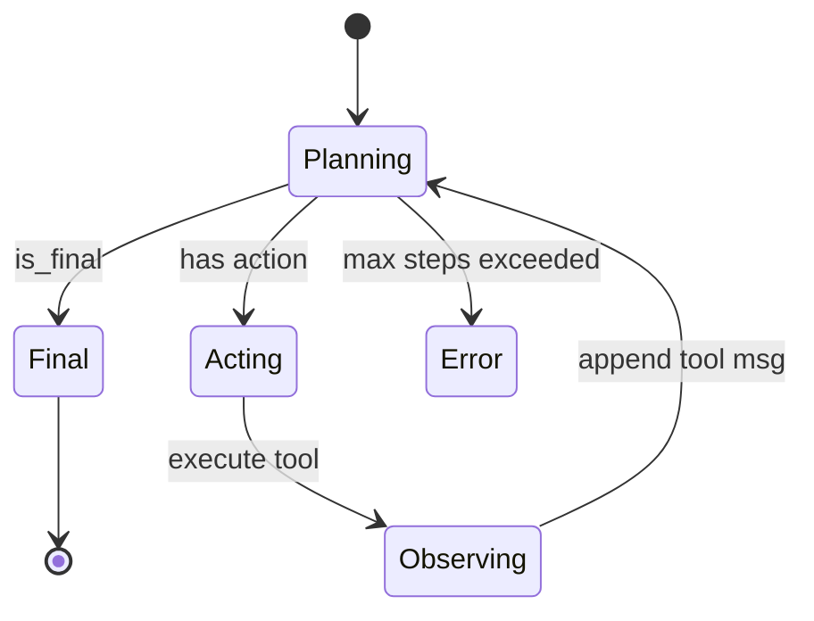

# 模块作用

**ReAct Agent**（Reasoning + Acting）是本项目的 **智能决策核心**。

它解决：用户问题往往需要 **多步** 才能完成——先想清楚、再查资料或算数、再看结果、最后总结。一次性让 LLM 输出答案容易错。

ReAct 把过程显式化为：

```
Thought（思考）→ Action（行动/调工具）→ Observation（观察结果）→ ... → Final Answer（最终回答）
```

代码在 `backend/agent/`，HTTP 入口是 `run_react_agent()`。

# 核心原理

## ReAct 论文思想

传统 CoT 只在模型内部「链式思考」。ReAct 允许思考过程中 **与外部环境交互**（工具、数据库、搜索引擎），把外部反馈写进上下文再继续想。

## 与 Agent 循环

每一 **步（step）**：

1. **Planner** 读当前 messages，调 LLM（带 tools）
2. **Parser** 解析输出：要么 Final Answer，要么 Action
3. 若有 Action → **Executor** 跑工具 → Observation 写入 messages
4. 重复，直到 Final Answer 或超过 `max_agent_steps`

## 两种终止条件

- **正常**：LLM 输出 Final Answer（`is_final=True`）
- **异常**：步数超过 10 且无 Final Answer → `ValueError`

# 项目中的实现方式

## 模块分工

| 文件 | 职责 |
|------|------|
| `loop.py` | 主循环 `run_react_agent`，返回 `ReActResult` |
| `planner.py` | `plan()` — 调 LLM + 解析 |
| `executor.py` | `execute()` — 调 registry |
| `parser.py` | `Action`, `PlannerResult`, `parse_llm_response` |
| `memory.py` | `AgentMemory`, `ReActStep` — messages + trace |
| `prompts.py` | `REACT_SYSTEM_PROMPT` — 格式与工具使用规则 |
| `runner.py` | 向后兼容薄封装 |

## 主循环（核心代码）

```82:114:backend/agent/loop.py
    for step_num in range(1, settings.max_agent_steps + 1):
        planner_result = plan(memory)
        // ...
        if planner_result.is_final:
            // ...
            return ReActResult(response=final_answer, trace=memory.trace)
        // ...
        observation = execute(action)
        memory.append_tool_result(action.tool_call_id, observation)
        memory.add_trace_step(step=step_num, thought=..., action=..., observation=...)
```

## 初始 messages 构成

```71:75:backend/agent/loop.py
    initial_messages = [
        {"role": "system", "content": REACT_SYSTEM_PROMPT},
        *history,   // Session 历史
        {"role": "user", "content": user_message},
    ]
```

Session 历史是 **干净的 user/assistant**，不含上一轮 ReAct 的 tool 细节。

## System Prompt 要点

`prompts.py` 中要求：

- 输出格式含 `Thought:`、`Action:` 或 `Final Answer:`
- 数学 **必须** 用 `calculator`
- 文档问题 **优先** `search_docs`
- 每次 **只调一个** 工具

## Trace 返回前端

每步 `add_trace_step` 记录 thought/action/observation/final_answer。API 转成 `ReActStepSchema[]` 返回，供 Agent 可视化（前端待实现）。

## 与 RAG 集成方式

`loop.py` 注释说明：接 RAG **不用改 loop**，只需注册 `search_docs` 工具。Agent 通过 Tool Calling 间接使用向量库。

# 数据流

## 示例：「12345 × 67890 等于多少？」

```
Step 1:
  Thought: 需要精确计算
  Action: calculator({"expression": "12345 * 67890"})
  Observation: 838102050

Step 2:
  Thought: 已有结果
  Final Answer: 838102050
```

messages 演变：

```
[system, user]
→ [..., assistant+tool_calls]
→ [..., tool: "838102050"]
→ [..., assistant: Final Answer]
```

## 示例：文档问题

```
Step 1: search_docs({"query": "报销流程"})
Step 2: 基于 Observation 片段 Final Answer
```



# 面试题

> 每题提供两版回答：**30 秒版**适合开场快速应答，**2 分钟版**适合面试官追问「展开讲讲」。

## 什么是 ReAct？和 CoT、Plan-and-Execute 有何区别？

### 简短回答（30秒版）

ReAct 是 Reasoning + Acting：模型先 Thought，再 Action 调工具，看 Observation，循环直到 Final Answer。CoT 只想不动；Plan-and-Execute 先整计划再执行，ReAct 每步可修正更灵活。

### 深入回答（2分钟版）

CoT 纯链式推理，无外部环境。ReAct 在 `agent/loop.py` 实现 Thought→Action→Observation 交错，Planner 调 LLM，Executor 跑 registry 工具。Plan-and-Execute 适合长任务先规划再逐步执行；ReAct 更适合需要中途根据 Observation 调整的场景，如先 search_docs 再 calculator。我们 Prompt 在 `prompts.py` 强制 ReAct 格式，parser 解析 Final Answer 或 tool_calls。

## 描述你们 Agent 循环的伪代码

### 简短回答（30秒版）

初始化 messages = system + history + user；循环最多 N 步：plan → 若 final 则 return；否则 execute(action) → 把 observation 写入 memory → 下一轮。

### 深入回答（2分钟版）

与 `loop.py` 一致：`memory = AgentMemory(initial_messages)`；`for step in 1..max_agent_steps`：`planner_result = plan(memory)`；append assistant message；若 `is_final` 则 `add_trace_step` 并 return `ReActResult`；否则 `observation = execute(action)`，`append_tool_result` 或 fallback user 消息，`add_trace_step` 继续。超步数 raise ValueError。API 层把 trace 转成 steps 返回前端。

## Thought 是否必须显式输出？不输出怎么办？

### 简短回答（30秒版）

理想情况 LLM 输出 `Thought:`。若没有，parser 用默认文案「模型未输出显式 Thought」，不影响 tool 执行，但 trace 可观测性变差。

### 深入回答（2分钟版）

`parser.py` 的 `_extract_thought()` 正则匹配 `Thought: ...`，直到 Action/Final Answer。无标记时取 content 或默认句。原生 tool_calls 时 thought 可能在 content 里较短。Prompt 要求写 Thought 便于调试和前端 Execution Viewer。生产可加 validator 或 few-shot 提高 compliance。

## max_agent_steps 为什么需要？

### 简短回答（30秒版）

防止 LLM 无限调工具导致死循环、延迟爆炸和成本失控。我们默认 10，config 可调，超限抛错 API 返回 503。

### 深入回答（2分钟版）

弱模型可能反复 search_docs 或 calculator 不给 Final Answer。`config.max_agent_steps=10` 在 `loop.py` hard cap。这是 Agent 生产必备 guardrail。可配合：单 tool 调用次数限制、总 token 预算、超时。超步数时 ideally 返回 partial trace 帮用户理解卡在哪。

## Planner 和 Executor 为什么要分开？

### 简短回答（30秒版）

单一职责：Planner 只调 LLM 做决策，Executor 只跑确定性 Python 工具。便于单测 mock LLM，也便于换本地/远程执行引擎。

### 深入回答（2分钟版）

`planner.py`：`chat_completion` + `parse_llm_response`，不涉及业务工具逻辑。`executor.py`：转发 `registry.execute_tool`，不碰 Prompt。测试可 stub plan 返回固定 Action 测 execute；或 stub registry 测 loop 终止条件。扩展 Remote Tool（HTTP MCP）只改 Executor 层。

## Session history 注入 Agent 会带来什么问题？

### 简短回答（30秒版）

Session 只存干净 user/assistant，不存 tool 过程，省 token；但用户早期约束可能在 FIFO 截断后丢失，长对话可能 context 不够。

### 深入回答（2分钟版）

`get_history_messages()` 不含上一轮 ReAct 的 tool 细节，Agent 只见最终回复。若用户说「用刚才那个数再乘 2」，而中间计算未出现在 assistant 文本里，可能丢失上下文。`max_session_turns=10` FIFO 删最早轮。改进：longterm summary、把关键 tool 结果写入 assistant 摘要、按 token 截断。

## 如果 LLM 既不调工具也不给 Final Answer 怎么办？

### 简短回答（30秒版）

`loop.py` 抛 `ValueError("Planner returned neither Action nor Final Answer")`，API 503。应优化 parser 和 Prompt 减少这种情况。

### 深入回答（2分钟版）

Parser 要求互斥：`is_final` 或有效 `action`。空 content 且无 tool_calls 会触发。可能原因：模型输出格式不合规、Prompt 冲突、API 异常截断。缓解：retry plan 一次、fallback prompt「请给出 Final Answer」、记录 raw message 便于调试。产品层可返回友好文案而非 raw error。

## trace 和 messages 有什么区别？

### 简短回答（30秒版）

messages 是发给 LLM 的完整对话，含 tool 消息。trace 是结构化步骤摘要，给日志和前端展示，默认不再喂回 LLM。

### 深入回答（2分钟版）

`AgentMemory.messages` 遵循 OpenAI 格式，下一轮 plan 必读。`AgentMemory.trace` 是 `ReActStep` 列表（thought/action/observation/final_answer），经 API `ChatResponse.steps` 返回。SessionStore 不存 trace。前端 aside 应用 trace 做 Execution Viewer；messages 若 replay trace 会格式错乱且浪费 token。

## 如何评估 Agent 效果？

### 简短回答（30秒版）

准备 benchmark 任务集，看 Final Answer 正确率、工具调用是否选对、平均步数和延迟，再加人工抽检 trace。

### 深入回答（2分钟版）

指标：answer accuracy（与标准答案比）、tool selection precision（该调 calculator 是否调了）、step efficiency（平均步数）、latency P95、成本 per query。数据集覆盖：纯闲聊、纯计算、纯 RAG、组合任务。我们 steps API 已支持人工审 trace。可引入 AgentBench、WebArena 或自建 50 条业务用例回归。

## ReAct 的缺点是什么？

### 简短回答（30秒版）

多轮 LLM 贵且慢；一步错可能传播；弱模型 tool 格式不稳定；长 trace 占 context window。

### 深入回答（2分钟版）

每步一次 API 调用，10 步就是 10 倍 latency 和 token。Planner 误判 tool 会导致错误 Observation 级联。相比单次 RAG 或单次 CoT，ReAct 适合复杂任务但 overhead 高。优化：ReWOO 减少调用、tool 结果缓存、强模型 Planner + 弱模型不可行时换模型。MVP 用 ReAct 是为展示 Agent 能力。

## 能否让 Agent 自动选择不用工具直接回答？

### 简短回答（30秒版）

可以。简单闲聊应直接 Final Answer。Prompt 说「需要才算/查文档」，不是每问都调工具，模型可自行判断。

### 深入回答（2分钟版）

`REACT_SYSTEM_PROMPT` 规定数学用 calculator、文档用 search_docs，但没禁止直接回答。「你好」类问题应一步 Final Answer。过度 tool 调用的调优：收紧 schema description、提高直接回答的 few-shot、监控 tool 调用率。这是 Agent 体验关键：该用才用。

## 文本 Action fallback 什么时候会用到？

### 简短回答（30秒版）

部分模型不支持 Function Calling，会在 content 里写 `Action: calculator(1+2)`。`parser.py` 正则提取。生产优先用支持 tool_calls 的模型。

### 深入回答（2分钟版）

`parse_llm_response` 优先 `message.tool_calls`；若无则 `_parse_text_action()` 匹配 `Action: tool_name(...)`。fallback 无 tool_call_id，loop 用 `{role:user, content:"Observation: ..."}` 模拟，与 OpenAI 标准略异但可跑。智谱 glm-4 等应走原生 tool_calls。fallback 是兼容性保险，不是主路径。

# 容易踩坑的问题

1. **assistant 消息顺序**：必须先 append assistant（含 tool_calls）再 append tool observation。
2. **tool_call_id 缺失**：fallback 文本 Action 无 ID 时，用 user 消息模拟 Observation（loop.py 137-143 行）。
3. **Session 与 Agent memory 混淆**：history 不含 tool，当前轮的 tool 只在 AgentMemory。
4. **Prompt 与 parser 不一致**：Prompt 写 `Action:` 但模型只返回 tool_calls，需两条解析路径都测。
5. **超步数无友好回复**：目前直接 503，产品层可改为「请简化问题」。

# 进阶知识

- **Reflexion / Self-criticism**：失败后让模型反思再试
- **ReWOO / Plan-and-Solve**：减少 LLM 调用次数
- **LangGraph 状态机**：显式节点与边
- **工具结果缓存**：相同 query 不重复检索
- **多 Agent 协作**：Researcher + Writer 分工

**相关文档**：[tool-calling.md](./tool-calling.md) · [memory.md](./memory.md) · [llm.md](./llm.md) · [frontend.md](./frontend.md)
