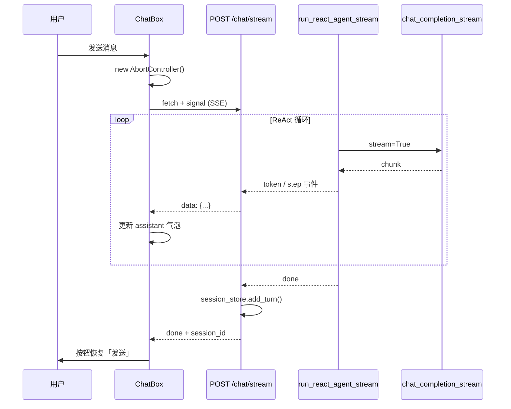
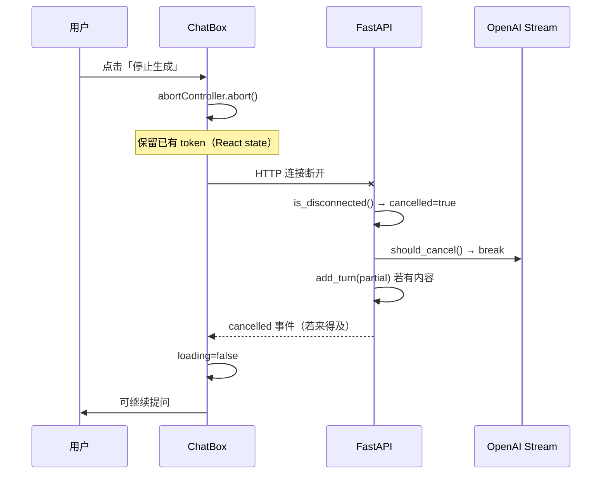

# 模块作用

**停止生成（Stop Generating）** 让用户在 AI 回答过程中**随时中断**，并**保留已输出的内容**，不影响后续继续提问。

ChatGPT、Claude 等产品都有此能力。没有它时，用户只能等 Agent 跑完（ReAct 多轮 + 工具调用可能数十秒），体验差且浪费 token。

本功能同时引入了 **SSE 流式聊天**，因此文档也覆盖流式输出链路。停止生成是流式场景下的「取消传播（Cancellation Propagation）」。

| 能力 | 作用 |
|------|------|
| 流式输出 | Final Answer 逐 token 显示，打字机效果 |
| 停止按钮 | 生成中 InputBox 右侧显示「停止生成」 |
| 保留 partial | 已推送 token 留在聊天气泡，写入 Session（若有内容） |
| 请求隔离 | 每次发送新建 `AbortController`，停止不影响下一次 |

# 核心原理

## 全链路取消

停止生成不是只改 UI，而是 **从前端一直取消到 OpenAI API**：

```
用户点击「停止生成」
  → AbortController.abort()
  → 浏览器断开 fetch / SSE 连接
  → FastAPI 检测 request.is_disconnected()
  → should_cancel() = True
  → OpenAI stream 循环 break
  → 前端保留 React state 中已有 token
```

## AbortController

浏览器标准 API，给异步操作（如 `fetch`）绑定可取消信号：

```javascript
const controller = new AbortController();
fetch(url, { signal: controller.signal });
controller.abort();  // 立即中断，抛出 AbortError
```

要点：

- **一次请求一个 Controller**，停止后不可复用，下次发送必须 `new AbortController()`
- `abort()` 后 `signal.aborted === true`
- 前端 catch `AbortError` 时不应展示为网络错误

## SSE（Server-Sent Events）

后端用 `StreamingResponse(media_type="text/event-stream")` 推送事件，格式：

```
data: {"type":"token","content":"你"}\n\n
data: {"type":"done","response":"...","session_id":"..."}\n\n
```

前端用 `fetch` + `ReadableStream` 解析（Axios 不适合 SSE）。每个 `data:` 行是一个 JSON 事件。

## FastAPI 如何感知客户端断开

```python
async def watch_disconnect():
    while not cancelled["value"]:
        if await request.is_disconnected():
            cancelled["value"] = True
            return
        await asyncio.sleep(0.05)
```

注意：ReAct Agent 的 LLM 调用是**同步阻塞**的。若在 async generator 里直接跑同步循环，会**阻塞事件循环**，`is_disconnected()` 无法及时触发。本项目采用 **后台线程 + 队列** 跑 Agent，主协程轮询断开状态。

## OpenAI 流式如何中断

```python
stream = client.chat.completions.create(..., stream=True)
for chunk in stream:
    if should_cancel and should_cancel():
        break  # 退出循环，关闭 HTTP 连接
    yield chunk
```

客户端断开后 OpenAI 侧也会停止继续生成（节省 token 成本）。

# 项目中的实现方式

## 涉及文件

### 后端

| 文件 | 职责 |
|------|------|
| `backend/core/llm.py` | `chat_completion_stream()` — `stream=True`，chunk 间检查 cancel |
| `backend/agent/planner.py` | `plan_stream()` — 流式规划，仅 Final Answer 后推送 token |
| `backend/agent/loop.py` | `run_react_agent_stream()` — 可取消 Agent 循环，yield SSE 事件 |
| `backend/api/chat.py` | `POST /chat/stream` — SSE 端点 + 断开检测 + Session 写入 |

### 前端

| 文件 | 职责 |
|------|------|
| `frontend/src/services/api.js` | `chatStreamAPI()` — fetch + AbortSignal + SSE 解析 |
| `frontend/src/components/ChatBox.jsx` | AbortController 生命周期、流式消息 state |
| `frontend/src/components/InputBox.jsx` | 生成中显示「停止生成」 |
| `frontend/src/components/MessageList.jsx` | 空 assistant 显示 typing，有内容逐字追加 |
| `frontend/src/App.css` | 停止按钮红色样式 `.input-box__send--stop` |

原 `POST /chat`（非流式 JSON）**保留**，供兼容与调试；聊天 UI 默认走 `/chat/stream`。

## SSE 事件协议

| type | 字段 | 说明 |
|------|------|------|
| `token` | `content` | Final Answer 文本片段 |
| `step` | `step` | ReAct 单步 trace（Thought / Action / Observation） |
| `done` | `response`, `session_id`, `steps` | 正常完成 |
| `cancelled` | `response`, `session_id` | 用户停止，含已生成 partial |
| `error` | `detail` | 错误信息 |

## LLM 流式层

`core/llm.py` 新增 `chat_completion_stream()`：

```100:146:backend/core/llm.py
def chat_completion_stream(
    messages: list[dict],
    *,
    tools: list[dict] | None = None,
    should_cancel: Callable[[], bool] | None = None,
) -> Iterator[Any]:
    // ...
    stream = client.chat.completions.create(**request_kwargs)

    for chunk in stream:
        if should_cancel and should_cancel():
            logger.info("[LLM] 流式请求被客户端取消")
            break
        yield chunk
```

## Planner 只推送 Final Answer token

ReAct 中间轮次输出 Thought / tool_calls，不应出现在聊天气泡。`plan_stream()` 检测到 `"Final Answer:"` 标记后才开始 `on_answer_token` 回调：

```
LLM 流: "Thought: ... Final Answer: 你好世界"
                              ↑ 从这里开始推送 token
```

若无 Final Answer 标记但 parser 判定为最终回答，则在流结束后补发全文。

## Agent 流式循环

`run_react_agent_stream()` 与 `run_react_agent()` 逻辑平行，区别：

- 使用 `plan_stream()` 替代 `plan()`
- 通过 `yield {"type": "token", ...}` 推送 token
- 通过 `yield {"type": "step", ...}` 推送 trace（侧边栏 ExecutionViewer）
- `should_cancel()` 为 True 时抛出 `AgentCancelledError(partial_response)`

## API 层：线程 + 队列

`api/chat.py` 的 `/chat/stream`：

1. 后台线程运行 `run_react_agent_stream()`，事件放入 `queue.Queue`
2. 主 async 协程 `await asyncio.to_thread(queue.get)` 消费并 yield SSE
3. 并行 `watch_disconnect()` 监听客户端断开，设置 `cancelled["value"] = True`
4. `done` 时 `session_store.add_turn()`；`cancelled` 且有 partial 时也写入 Session

## 前端 ChatBox 状态机

```javascript
// 发送时
const abortController = new AbortController();
abortControllerRef.current = abortController;
setMessages([...prev, userMsg, emptyAssistantMsg]);

await chatStreamAPI(text, sessionId, {
  signal: abortController.signal,
  onEvent: (event) => {
    if (event.type === 'token') appendToAssistant(event.content);
    if (event.type === 'step') updateExecutionViewer(event.step);
    if (event.type === 'done') finalizeAssistant(event.response);
  },
});

// 停止时
abortControllerRef.current?.abort();
```

`AbortError` 且无任何 token 时，移除空 assistant 气泡（工具调用阶段停止的常见情况）。

## InputBox 按钮切换

```javascript
{isGenerating ? '停止生成' : '发送'}
className={isGenerating ? 'input-box__send--stop' : ''}
onClick={isGenerating ? onStop : onSend}
```

生成中按钮始终可点（红色），停止后 `loading=false`，恢复「发送」。

# 数据流

## 正常完成



## 用户点击停止



## 与改造前对比

| 维度 | 改造前 `POST /chat` | 改造后 `POST /chat/stream` |
|------|---------------------|----------------------------|
| 协议 | JSON 一次性返回 | SSE 多事件 |
| 前端 HTTP | Axios | fetch + ReadableStream |
| UI | Loading 三点动画 → 整段弹出 | 逐 token 打字机 |
| 停止 | 不支持 | AbortController + 后端 cancel |
| Session 写入 | 请求完成时 | done / cancelled 时 |

# 面试题

> 每题提供两版回答：**30 秒版**适合开场快速应答，**2 分钟版**适合面试官追问「展开讲讲」。

## ChatGPT 的「停止生成」一般怎么实现？

### 简短回答（30秒版）

前端用 AbortController 取消 fetch 或 SSE 连接；后端检测客户端断开，在 OpenAI stream 循环里 break；UI 保留已渲染 token，按钮恢复发送；可选把 partial 写入对话历史。

### 深入回答（2分钟版）

本质是 **Cancellation Propagation**：UI → HTTP 传输 → API 层 → 业务 generator → LLM SDK。ChatGPT 类产品在流式 Final Answer 时维护 streaming message state；Stop 触发 abort，浏览器关闭连接；服务端 StreamingResponse 停止消费或主动检测 disconnect；OpenAI `stream=True` 的 for 循环 break 后连接关闭，模型侧也停止计费。Partial 内容保留在前端 DOM/React state，后端可选择是否 persist 半截 assistant 消息。我们项目在 `ChatBox.jsx` + `chat.py` 实现了同样链路，ReAct 场景还需处理工具调用阶段无 token 可保留的边界。

## AbortController 是什么？为什么每次请求要新建？

### 简短回答（30秒版）

浏览器标准 API，给 fetch 等异步操作提供可取消的 signal。调用 `abort()` 后该 signal 永久 aborted，所以每次发送必须 `new AbortController()`，不能复用。

### 深入回答（2分钟版）

`AbortController` 包含 `signal` 和 `abort()` 方法。`fetch(url, { signal })` 绑定后，一旦 `abort()` 会 reject 为 `AbortError`。我们存在 `abortControllerRef` 里，发送时新建、停止/完成/新对话时在 finally 置 null。若复用旧 Controller，第二次请求可能一发出就被 aborted。与 React Strict Mode 双 mount 也要注意 cleanup 里 abort 避免泄漏。相比手动 flag，AbortController 是 Web 标准，fetch、axios（v0.22+）、EventSource 都支持。

## FastAPI 怎么处理客户端中断？

### 简短回答（30秒版）

`await request.is_disconnected()` 轮询检测；StreamingResponse 停止 yield；同步阻塞代码需放线程并设 cancel flag，否则事件循环被占满，检测不到断开。

### 深入回答（2分钟版）

Starlette 的 `Request.is_disconnected()` 在客户端关闭 TCP 后返回 True。纯 async generator 里每 yield 前检查即可。本项目 ReAct + OpenAI 同步 SDK 会阻塞 asyncio 事件循环，因此在 `chat.py` 用 **threading.Thread + queue.Queue** 跑 `run_react_agent_stream`，主协程 async 消费队列，并行 `watch_disconnect()` 每 50ms 检查。`should_cancel` lambda 读共享 `cancelled["value"]`，传入 `chat_completion_stream` 的 for 循环。这是 MVP 常见取舍；生产可换 async OpenAI client 或 `run_in_executor` 细粒度调度。

## OpenAI 流式输出如何中断？会浪费 token 吗？

### 简短回答（30秒版）

`stream=True` 后 for chunk in stream，cancel 时 break 关闭连接；OpenAI 对已生成 token 仍计费，但停止后不再继续生成新 token，比等完整回复省。

### 深入回答（2分钟版）

OpenAI Chat Completions streaming 通过 HTTP chunked 返回 SSE 风格 chunk。Python SDK 的 stream iterator break 后会关闭底层 HTTP 连接，服务端停止推送。已接收的 delta 仍计入 usage；未生成的部分不再产生。我们在 `llm.py` 每个 chunk 前调 `should_cancel()`。注意 tool_calls 流式 chunk 也要能中断，否则 stop 后仍可能在拼 arguments。ReAct 多轮时每一轮 planner 都是独立 stream，cancel 应贯穿所有轮次。

## 如何保证停止不影响下一次请求？

### 简短回答（30秒版）

每次发送新建 AbortController；finally 清空 ref；每次 `/chat/stream` 是独立 HTTP 连接；AgentMemory 请求级新建；Session 只在 done/cancelled 时写入，不污染全局状态。

### 深入回答（2分钟版）

前端：`handleSend` 开头 abort 旧请求并 `new AbortController()`，`finally` 里 `abortControllerRef.current = null`。后端：`run_react_agent_stream` 每次调用新建 AgentMemory 和 messages，无跨请求单例。SessionStore 按 session_id 追加 turn，cancel 时仅在有 partial 时 add_turn。Worker 线程 daemon=True，cancel 后 `should_cancel` 让 stream break，线程自然结束。要避免的是：全局 cancel flag 未重置、复用 aborted signal、stop 后 loading 未 false 导致 UI 卡死。

## 为什么停止后要保留已生成内容？

### 简短回答（30秒版）

用户 stop 表示「够了，不要继续」，不是「撤销」。已读到的 token 应留在气泡里，并可选写入 Session，否则 stop 等价于失败，体验差。

### 深入回答（2分钟版）

产品语义：Stop = 截断，不是 Retry 或 Delete。前端 token 事件已 append 到 assistant message state，abort 时不 rollback。后端 `AgentCancelledError.partial_response` 与 SSE `cancelled.response` 同步；非空则 `session_store.add_turn`，下轮对话 LLM 能看到半截 assistant 回复。若工具调用阶段 stop、尚无 Final Answer token，前端移除空 assistant 气泡，Session 不写入空 turn。这与 ChatGPT 行为一致：有输出则保留，纯 thinking 阶段 stop 可能什么都不留。

## 为什么 ReAct Agent 流式只推送 Final Answer 的 token？

### 简短回答（30秒版）

中间轮次是 Thought 和 tool_calls，属于 Agent 内部推理，不应直接展示在聊天气泡；侧边栏用 step 事件展示 trace 即可。

### 深入回答（2分钟版）

ReAct 每轮 planner 可能返回 calculator/search_docs 的 tool_calls，content 里是 Thought 而非给用户的话。若全部 token 推送到聊天气泡，用户会先看到「Thought: 我要查文档…」再消失，体验混乱。`plan_stream()` 缓冲到 `"Final Answer:"` 标记后才开始 `on_answer_token`。ExecutionViewer 通过 `step` 事件实时更新 Thought/Action/Observation。这是 Agent 流式与纯 RAG 流式的关键区别：聊天气泡流 Final Answer，侧边栏流 trace。

## 为什么不用 Axios 做 SSE？

### 简短回答（30秒版）

Axios 基于 XHR，不支持 ReadableStream 消费 SSE；fetch 原生支持 `response.body.getReader()` 和 AbortSignal。

### 深入回答（2分钟版）

SSE 需要逐块读 response body 并按 `\n\n` 拆 `data:` 行。fetch API 提供 Streams 标准，可配合 `TextDecoder` 增量解码。Axios 等完整 response 才 resolve，不适合 token 级流式。EventSource 只支持 GET，我们 POST JSON body 传 message/session_id，故用 fetch POST + 手动解析 SSE。`api.js` 的 `chatStreamAPI` 即此实现；upload 仍用 Axios FormData 因为无需流式。

## 同步 Agent 跑在线程里有什么风险？

### 简短回答（30秒版）

多线程 + GIL 下 CPU 绑定的工具仍阻塞；队列背压需注意；但 LLM IO 等待为主，MVP 可接受。生产应用 async client 或 Celery 任务队列。

### 深入回答（2分钟版）

`chat.py` producer 线程同步调用 OpenAI SDK，主线程 async yield SSE。风险：1）高并发时线程数膨胀；2）`execute()` 工具若 CPU 重仍会占 GIL；3）cancel 依赖 chunk 间检查，长间隔 chunk 停止有延迟。优点：不改现有 sync Agent 结构，disconnect watcher 能并行跑。改进方向：OpenAI AsyncClient、`asyncio.to_thread` 只包 LLM 调用、或把 chat 改成 WebSocket 双向 channel 降低 stop 延迟。

## 停止和「新对话」同时点会怎样？

### 简短回答（30秒版）

`handleNewChat` 会先 `abort()` 当前请求，再清 session 和 messages，不会串台。

### 深入回答（2分钟版）

`ChatBox.jsx` 的 `handleNewChat` 顺序：`abortControllerRef.current?.abort()` → `clearSessionId()` → 清空 messages/steps/loading。abort 触发 in-flight 请求的 AbortError，catch 里不再写 error（因是用户主动）。若 done 事件与 abort 竞态，finally 仍 `setLoading(false)`。Sidebar ExecutionViewer 同步清空 steps。边界：abort 后后端仍可能短暂写 Session partial——新对话已清 localStorage session_id，下一条会新建 session，旧 partial 留在旧 session 内存 dict 里，MVP 可接受。

## 如果面试官问「你会怎么测试停止生成」？

### 简短回答（30秒版）

手动：发长回答请求，中途点停止，看 partial 保留且能继续问。自动：mock fetch stream，调 abort()，断言 AbortError 且 assistant content 非空。

### 深入回答（2分钟版）

手工用例：1）Final Answer 流式中途 stop；2）工具调用阶段 stop（应无空气泡）；3）stop 后立即发下一条；4）stop 后新对话。后端单测：mock `chat_completion_stream` 多 chunk，should_cancel 第三 chunk 变 True，断言 `AgentCancelledError.partial_response`。API 集成测：TestClient 读 SSE 若干事件后关闭 client，断言 worker 退出。E2E 可用 Playwright 点「停止生成」查 DOM 文本长度不再增长。还要测 Session partial 是否 add_turn。

# 容易踩坑的问题

1. **同步 Agent 阻塞事件循环**：直接在 async generator 里 `for event in run_react_agent_stream()` 会导致 `is_disconnected()` 失效，stop 延迟到下一轮 LLM 才生效。
2. **复用 AbortController**：stop 或完成后必须新建，否则下次 fetch 立刻 aborted。
3. **AbortError 当网络错误**：catch 里要区分 `err.name === 'AbortError'`，不展示红色 error banner。
4. **工具阶段 stop 留空气泡**：尚无 token 时应删除 empty assistant 消息，否则永久显示 typing 动画。
5. **Thought 泄露到聊天气泡**：未过滤 Final Answer 前 token 会把 ReAct 中间推理展示给用户。
6. **Session 写入空 partial**：cancel 时 `partial.strip()` 为空则不要 `add_turn`，避免历史里出现空 assistant。
7. **axios 做 SSE**：Axios 无法逐 token 读流，必须用 fetch + ReadableStream。

# 进阶知识

- **WebSocket 双向取消**：比 SSE 更适合「stop 信号显式发送」而非依赖 TCP 断开
- **OpenAI AsyncClient + async generator**：消除线程，原生 async cancel
- **Structured concurrency**：Python 3.11+ TaskGroup 管理 disconnect watcher 与 stream consumer
- **Backpressure**：队列满时 slow down producer，防止内存暴涨
- **Usage 统计**：cancel 后仍记录已消耗 prompt/completion tokens 便于成本监控
- **RAG `/rag/ask` 流式 + stop**：无 ReAct 多轮，实现比 Agent 路径更简单，可复用同一套 AbortController 模式

**相关文档**：[architecture.md](./architecture.md) · [llm.md](./llm.md) · [react-agent.md](./react-agent.md) · [frontend.md](./frontend.md) · [backend.md](./backend.md)
