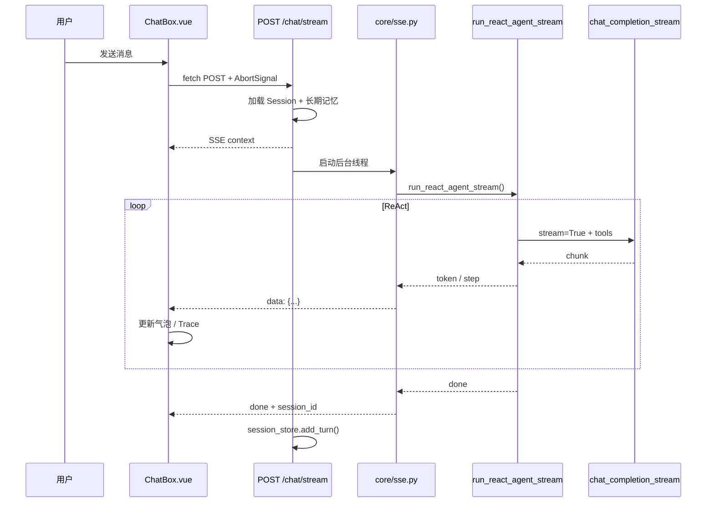

# LLM 流式输出（Streaming）

# 模块作用

**流式输出**让用户在 AI 生成回答时**实时看到文字**，而不是等数十秒后一次性弹出整段内容——体验类似 ChatGPT 的「打字机效果」。

本项目在三条链路上支持 SSE 流式：

| 链路 | 端点 | 流式内容 |
|------|------|----------|
| ReAct Agent 聊天 | `POST /chat/stream` | Final Answer 逐 token；ReAct step 整步推送 |
| RAG 文档问答 | `POST /rag/ask/stream` | LLM 回答逐 token |
| 长期记忆问答 | `POST /memory/ask/stream` | LLM 回答逐 token |

同步备用接口（`POST /chat`、`/rag/ask`、`/memory/ask`）保留，供调试与兼容。

# 核心原理

## SSE（Server-Sent Events）是什么

SSE 是一种 **服务器 → 客户端单向推送** 的 HTTP 协议：

- Content-Type: `text/event-stream`
- 每条消息格式: `data: {JSON}\n\n`（双换行分隔）
- 基于普通 HTTP 长连接，服务器持续 `yield` 数据块
- **单向**：客户端问题已通过 POST body 发出，同一连接只收推送

**为什么选 SSE 而不是 WebSocket：**

- AI 聊天本质是「问一次、收多次」，不需要双向实时通道
- 实现简单，FastAPI / 浏览器原生支持
- 走标准 HTTP，穿透代理更容易
- ChatGPT 等产品同样使用 SSE

**为什么不用 EventSource：**

- 浏览器 `EventSource` 只支持 GET
- 我们需要 POST JSON（`message`、`session_id`）
- 因此前端用 `fetch` + `ReadableStream` 手动解析 SSE

## 流式 vs 普通请求

| 维度 | 普通请求 | 流式请求 |
|------|----------|----------|
| 连接 | 短连接，一次响应 | 长连接，多次推送 |
| 响应时机 | 全部完成后返回 | 边生成边返回 |
| 前端 API | Axios / fetch 等 JSON | fetch + ReadableStream |
| 用户体验 | 长时间空白 → 整段弹出 | 逐字打字机效果 |
| 取消 | 难以中途停止 | AbortController 随时断开 |
| 复杂度 | 低 | 需 SSE 解析、事件协议、状态管理 |

# 项目中的实现方式

## 五层架构（自底向上）

```
Layer 1  core/llm.py           OpenAI stream=True，yield chunk
Layer 2  agent/planner.py      ReAct 过滤 Final Answer token
         rag/memory/chain.py    纯文本 stream_text_completion
Layer 3  agent/loop.py          包装 token/step/done 事件
Layer 4  core/sse.py            sync generator → async SSE
         api/chat|rag|memory.py HTTP 入口 + Session 持久化
Layer 5  frontend/utils/sse.js  fetch 解析 SSE
         frontend/services/api.js
         frontend/ChatBox.vue    实时更新 UI
```

---

## Step 1 — LLM 层：`core/llm.py`

**为什么在这一层做：** 最接近 OpenAI API，只负责「打开 stream、逐 chunk 返回」，不关心 ReAct 或 SSE。

```python
# 通用流式 — ReAct planner 使用（可带 tools）
def chat_completion_stream(messages, *, tools=None, should_cancel=None):
    stream = client.chat.completions.create(..., stream=True)
    for chunk in stream:
        if should_cancel and should_cancel():
            break
        yield chunk

# 纯文本流式 — RAG / Memory 使用（无 Tool Calling）
def stream_text_completion(messages, *, should_cancel=None):
    for chunk in chat_completion_stream(messages, tools=None, ...):
        if chunk.choices[0].delta.content:
            yield delta.content  # 直接 yield 字符串 token
```

**设计要点：**

- `should_cancel` 在每个 chunk 间检查，支持「停止生成」
- RAG/Memory 与 ReAct 分离：后者需要 tools + Final Answer 过滤，前者直接流 content

---

## Step 2 — 业务层：Planner / Chain

### ReAct 路径 — `agent/planner.py`

**为什么需要过滤：** ReAct 每轮输出 `Thought: ... Action: ...` 或 `Final Answer: ...`。若全部 token 推到聊天气泡，用户会先看到内部推理再消失，体验混乱。

```python
def plan_stream(memory, *, on_answer_token=None, should_cancel=None):
    for chunk in chat_completion_stream(memory.messages, tools=tools, ...):
        if delta.content:
            if not final_answer_started:
                # 缓冲直到检测到 "Final Answer:" 标记
                if "Final Answer:" in pending_answer:
                    final_answer_started = True
                    on_answer_token(answer_part)
            else:
                on_answer_token(piece)  # 标记之后逐 token 推送
```

**设计要点：**

- 聊天气泡只流 **Final Answer**
- Thought / Action / Observation 通过 `step` 事件整步推送（侧边栏 ExecutionViewer）

### RAG / Memory 路径 — `rag/chain.py`、`memory/chain.py`

**为什么更简单：** 无 ReAct 多轮、无 Tool Calling，检索完成后直接 `stream_text_completion`。

```python
def rag_ask_stream(question, ...):
    sources, messages, context = _prepare_rag_messages(...)  # 同步检索
    yield {"type": "context", "sources": ..., "context_preview": ...}
    for token in stream_text_completion(messages, should_cancel=should_cancel):
        yield {"type": "token", "content": token}
    yield {"type": "done", "answer": ..., "sources": ...}
```

---

## Step 3 — Agent 编排层：`agent/loop.py`

**为什么在这一层：** 统一 ReAct 循环逻辑，把 planner 的 token 回调转为结构化 SSE 事件。

```python
def run_react_agent_stream(...) -> Iterator[dict]:
    def _on_answer_token(token):
        partial_response += token
        pending_tokens.append(token)

    for step_num in range(1, max_steps + 1):
        planner_result = plan_stream(memory, on_answer_token=_on_answer_token, ...)
        yield from _flush_tokens()  # {"type": "token", "content": "..."}

        if planner_result.is_final:
            yield {"type": "step", "step": {...}}
            yield {"type": "done", "response": ..., "steps": ...}
            return

        # 工具调用轮
        yield {"type": "step", "step": {...}}
        observation = execute(action)
        yield {"type": "step", "step": {..., "observation": ...}}
```

**事件协议：**

| type | 说明 |
|------|------|
| `context` | 记忆检索上下文（chat 专用，API 层 initial_events 推送） |
| `token` | Final Answer 文本片段 |
| `step` | ReAct 单步 trace |
| `done` | 正常完成 |
| `cancelled` | 用户停止 |
| `error` | 错误 |

---

## Step 4 — HTTP 层：`core/sse.py` + `api/*.py`

**为什么需要 sse.py：** OpenAI SDK 是**同步**的，FastAPI 路由是 **async**。直接在 async generator 里跑同步 LLM 会阻塞事件循环，导致 `is_disconnected()` 无法及时检测客户端断开。

**桥接模式：后台线程 + queue**

```
async 主协程                    sync 后台线程
  │                                  │
  │ watch_disconnect()               │ run_react_agent_stream()
  │   is_disconnected()?             │   for event in ...:
  │                                  │     queue.put(event)
  │ await queue.get()  ←─────────────│
  │ yield format_sse_event(event)    │
```

```python
# core/sse.py
def create_sse_response(producer, *, http_request, should_cancel, initial_events):
    return StreamingResponse(
        wrapped_generator(),  # 监听断开 + 桥接 sync producer
        media_type="text/event-stream",
        headers={"Cache-Control": "no-cache", "X-Accel-Buffering": "no"},
    )
```

**API 层职责（以 chat 为例）：**

1. 加载 Session 短期记忆 + FAISS 长期记忆
2. 推送 `context` 事件（initial_events）
3. 运行 producer，在 `done` / `cancelled` 时写入 Session
4. 返回 `StreamingResponse`

RAG / Memory 端点结构相同，复用 `create_sse_response`。

---

## Step 5 — 前端：`utils/sse.js` + `ChatBox.vue`

**为什么不用 Axios：** Axios 基于 XHR，等完整 response 才 resolve，无法逐 token 读流。

```javascript
// utils/sse.js — 通用 SSE 解析
export async function postSSE(url, body, { signal, onEvent }) {
  const response = await fetch(url, { method: 'POST', body: JSON.stringify(body), signal });
  const reader = response.body.getReader();
  // 按 \n\n 切分，解析 data: {JSON}
  while (...) {
    onEvent?.(JSON.parse(...));
  }
}

// ChatBox.vue — 事件驱动 UI 更新
await chatStreamAPI(text, sessionId, {
  signal: abortController.signal,
  onEvent: (event) => {
    if (event.type === 'token') appendToAssistant(event.content);
    if (event.type === 'step') updateExecutionViewer(event.step);
    if (event.type === 'done') finalizeAssistant(event.response);
  },
});
```

**状态机要点：**

- 发送时：新建 `AbortController`，插入空 assistant 气泡
- `token` 事件：追加 content（打字机效果）
- `done` 事件：写入 session_id，刷新 Memory 面板
- `AbortError`：保留已有 token，移除空气泡（工具阶段 stop 时）

# 数据流

## 完整时序（Agent 聊天）



# 面试题

## SSE 和 WebSocket 怎么选？

### 简短回答（30秒版）

AI 聊天是单向推送，SSE 基于 HTTP 更简单；WebSocket 适合双向实时（协作编辑、游戏）。我们 POST 传参 + SSE 收流，够用且易部署。

### 深入回答（2分钟版）

SSE 用 `text/event-stream`，服务器 `yield data:...\n\n`，浏览器 fetch ReadableStream 解析。WebSocket 全双工但需独立协议和心跳。ChatGPT 类产品主流 SSE。我们因 EventSource 不支持 POST body，用 fetch 手动解析。Nginx 需 `X-Accel-Buffering: no` 防缓冲。若要做「stop 显式信令」而非 TCP 断开，可考虑 WebSocket。

## 为什么 ReAct 只流式 Final Answer？

### 简短回答（30秒版）

中间轮是 Thought 和 tool_calls，属于 Agent 内部推理，不应出现在聊天气泡；ExecutionViewer 通过 step 事件展示 trace。

### 深入回答（2分钟版）

`plan_stream()` 缓冲到 `"Final Answer:"` 后才开始 `on_answer_token`。工具调用轮的 content 是「Thought: 我要查文档」，推给用户会困惑。侧边栏 ExecutionViewer 收 step 事件实时更新 Thought/Action/Observation。RAG/Memory 路径无 ReAct，直接 `stream_text_completion` 全量流式。这是 Agent 流式与纯 QA 流式的关键区别。

## 同步 LLM 如何接入 async FastAPI？

### 简短回答（30秒版）

后台线程跑 sync OpenAI SDK，事件放 queue；主 async 协程消费 queue 并 yield SSE；并行轮询 `is_disconnected()` 设置 cancel flag。

### 深入回答（2分钟版）

直接在 async generator 里 `for chunk in sync_stream` 会阻塞 asyncio 事件循环，`request.is_disconnected()` 无法及时触发。`core/sse.py` 的 `bridge_sync_iterator_to_sse` 用 threading.Thread + queue.Queue 桥接。生产可换 OpenAI AsyncClient 消除线程，或用 `asyncio.to_thread` 细粒度调度。注意 async generator 不能 `gen()` 二次调用，应 `async for chunk in gen`。

## 前端如何实现打字机效果？

### 简短回答（30秒版）

先插入空 assistant 消息，每收到 token 事件 append content，Vue/React 响应式更新自动重渲染。

### 深入回答（2分钟版）

`ChatBox.vue` 发送时 `createMessage('assistant', '')`，`onEvent` 里 `updateAssistantMessage(id, prev => prev + event.content)`。MessageList 渲染 content 随 ref 变化更新。loading 时 InputBox 显示「停止生成」。done 时用完整 response 覆盖（防 token 拼接误差）。AbortError 且无 token 时删除空气泡。

## 流式输出如何测试？

### 简短回答（30秒版）

手动发长问题看逐字效果；后端 mock stream 断言 SSE 格式；TestClient 读 events 后断开测 cancel。

### 深入回答（2分钟版）

手工：Final Answer 中途 stop、工具阶段 stop、stop 后继续提问。单元测：`bridge_sync_iterator_to_sse` async for 断言 `data:` 行。集成测：mock `run_react_agent_stream` yield token+done，httpx 读 stream。E2E：Playwright 查 DOM 文本随时间增长。还要测 partial 是否 add_turn、AbortError 不误报网络错误。

# 容易踩坑的问题

1. **async generator 二次调用**：`bridge_sync_iterator_to_sse` 返回的是 async generator，应 `async for x in gen`，不能 `gen()`
2. **同步 Agent 阻塞事件循环**：必须 thread + queue，否则 stop 延迟
3. **Thought 泄露**：未过滤 Final Answer 前 token 会展示内部推理
4. **Axios 做 SSE**：无法逐 token 读流，必须用 fetch
5. **Nginx 缓冲**：缺少 `X-Accel-Buffering: no` 会导致「假流式」——全部生成完才显示
6. **复用 AbortController**：每次发送必须 `new AbortController()`

# 进阶知识

- **AsyncOpenAI**：消除 thread/queue，原生 async generator
- **RAG/Memory 流式**：已实现 `/rag/ask/stream`、`/memory/ask/stream`，比 Agent 路径更简单
- **Thought 流式**：新增 `thinking` 事件类型，仅在 ExecutionViewer 展示
- **Backpressure**：queue 满时 slow down producer

**相关文档**：[stop-generation.md](./stop-generation.md) · [llm.md](./llm.md) · [react-agent.md](./react-agent.md) · [frontend.md](./frontend.md) · [backend.md](./backend.md)
