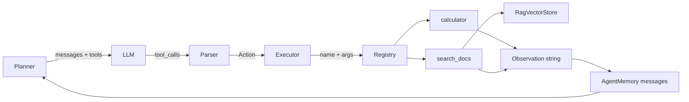

# 模块作用

**Tool Calling（工具调用）** 让 LLM 从「只会说话」变成「能动手」。

本项目中，工具层（`backend/tools/`）解决：

- **定义** Agent 能用什么能力（calculator、search_docs）
- **描述** 每个工具的参数（OpenAI Function Schema），让 LLM 知道怎么调
- **执行** LLM 返回的工具名和 JSON 参数，把结果字符串返回给 Agent 循环

没有 Tool Calling，Agent 只能凭记忆回答数学和文档问题，必然幻觉。

# 核心原理

## Function Calling 流程

```
1. 应用把 tools=[{ name, description, parameters }] 发给 LLM
2. LLM 决定调用 calculator，返回 tool_calls
3. 应用本地执行 run_calculator("123*456")
4. 应用把结果以 role=tool 消息追加到对话
5. LLM 读取 Observation，继续推理或给出 Final Answer
```

## Schema 是什么

Schema 是工具的「说明书」，JSON Schema 格式，例如 `calculator` 需要 `expression: string`。

LLM **从未执行代码**，它只是生成「要调哪个函数、参数是什么」；真正执行在 **你的 Python 进程** 里，可控、可审计。

## Registry 模式

所有工具注册到 `_TOOL_REGISTRY`：

```python
"calculator": { "schema": ..., "handler": lambda args: run_calculator(args["expression"]) }
```

Agent 只认识两个函数：`get_tool_schemas()` 和 `execute_tool(name, args_json)`。

# 项目中的实现方式

## 注册表

`backend/tools/registry.py`：

```23:32:backend/tools/registry.py
_TOOL_REGISTRY: dict[str, dict] = {
    "calculator": {
        "schema": CALCULATOR_TOOL_SCHEMA,
        "handler": lambda args: run_calculator(args["expression"]),
    },
    "search_docs": {
        "schema": SEARCH_DOCS_TOOL_SCHEMA,
        "handler": lambda args: run_search_docs(args["query"]),
    },
}
```

新增工具三步：写 schema + handler → 注册 → 无需改 Agent loop。

## calculator 工具

`backend/tools/calculator.py`：

- **用途**：精确数学计算，避免 LLM 算术错误
- **安全**：用 AST 白名单解析，只允许 `+ - * /` 和括号，防 `eval` 注入
- **Schema 字段**：`expression: string`

## search_docs 工具

`backend/tools/search_docs.py`：

- **用途**：把 RAG 检索包装成 Agent 可调用的 Action
- **内部**：`RagVectorStore` → `search_similar()` → `format_search_results()`
- **Observation 格式**：`[1] 手册.pdf p.3 (score=0.82): 报销流程...`

这是 **Agent + RAG 的桥梁**：Agent 不需要懂 Chroma，只需调 `search_docs`。

## 执行链路

```
planner.plan()
  → LLM 返回 tool_calls
  → parser.parse_llm_response() → Action(tool_name, arguments, tool_call_id)
  → executor.execute(action)
  → registry.execute_tool(name, arguments_json)
  → handler 返回 str
  → memory.append_tool_result(tool_call_id, observation)
```

`backend/agent/executor.py` 薄薄一层，转发到 registry。

## 解析双路径

`backend/agent/parser.py`：

1. **优先**：原生 `message.tool_calls`（标准 Function Calling）
2. **Fallback**：文本 `Action: calculator(1+2)` 正则解析
3. **结束**：`Final Answer:` 标记 → `is_final=True`

# 数据流



## 一次 search_docs 的数据

```
query: "报销流程"
  → embed_text(query)
  → vectorstore.search(embedding, top_k=3)
  → format 3 条 chunk 为纯文本
  → 作为 tool message content 回到 LLM
```

# 面试题

> 每题提供两版回答：**30 秒版**适合开场快速应答，**2 分钟版**适合面试官追问「展开讲讲」。

## 什么是 Tool Calling / Function Calling？

### 简短回答（30秒版）

让 LLM 输出结构化「函数调用请求」，由应用在本地执行真实逻辑，再把结果作为 Observation 喂回去。比让模型假装会算数、假装看过 PDF 可靠得多。

### 深入回答（2分钟版）

OpenAI 风格 Function Calling：请求带 `tools` schema，模型返回 `tool_calls`（name + arguments JSON + id）。本项目 `planner.py` 调 `chat_completion(messages, tools=get_tool_schemas())`，`parser.py` 解析为 Action，`executor.py` 经 `registry.execute_tool()` 执行，结果以 `role=tool` 追加 messages。这是 ReAct 的 Action 环节的技术实现，把 LLM 推理和确定性工具执行解耦。

## 你们项目里有哪些工具？各自解决什么问题？

### 简短回答（30秒版）

两个工具：`calculator` 做安全算术，避免 LLM 算错；`search_docs` 从 Chroma 知识库检索文档片段，把 RAG 能力包装成 Agent 可调用的 Action。

### 深入回答（2分钟版）

`tools/registry.py` 注册：`calculator` → `run_calculator(expression)`，AST 白名单计算；`search_docs` → `run_search_docs(query)`，内部 `search_similar()` + `format_search_results()`。分别解决精确数学和私有文档 QA。Agent Prompt 要求数学必用 calculator、文档优先 search_docs。新增工具只需注册 schema+handler，Planner 自动可见。

## 为什么计算器要用 AST 而不是 eval？

### 简短回答（30秒版）

`eval` 能执行任意 Python，用户若注入恶意表达式可能 RCE。我们用 AST 白名单，只允许加减乘除和括号，安全可控。

### 深入回答（2分钟版）

`calculator.py` 用 `ast.parse` 遍历节点，仅允许 Constant、BinOp（Add/Sub/Mult/Div）、UnaryOp 等。若表达式含 `__import__`、`open` 等会拒绝。Agent 场景下 LLM 生成的 expression 可能被 prompt injection 影响，eval 风险太高。AST 方案是业界常见 safe eval 模式，面试可强调「工具层必须当不可信输入处理」。

## tool_call_id 是干什么的？

### 简短回答（30秒版）

OpenAI 协议要求 Observation 消息通过 `tool_call_id` 与某次调用绑定。一轮多个 tool 时不能乱序，append tool 结果必须带对 ID。

### 深入回答（2分钟版）

LLM 返回的每个 tool_call 有唯一 id（如 `call_abc123`）。`AgentMemory.append_tool_result(tool_call_id, content)` 写入 `{role:"tool", tool_call_id, content}`。下一轮 LLM 靠 id 知道哪条 Observation 对应哪次 Action。文本 Action fallback 无 id 时，loop 用 user 消息模拟 Observation，是兼容方案但不如标准 tool 消息规范。

## 如何新增第三个工具（比如查天气）？

### 简短回答（30秒版）

三步：写 `weather.py` 定义 schema 和 `run_weather(city)`；在 `_TOOL_REGISTRY` 加一行；不用改 Agent loop，Planner 自动拿到新工具。

### 深入回答（2分钟版）

参照 `calculator.py`：定义 `WEATHER_TOOL_SCHEMA`（OpenAI function 格式，含 name、description、parameters），实现 handler 返回 str。在 `registry.py` 的 `_TOOL_REGISTRY` 添加 `"weather": {schema, handler}`。`get_tool_schemas()` 自动包含。可选：在 `REACT_SYSTEM_PROMPT` 补充使用场景。单测可 mock HTTP 调天气 API。体现开闭原则。

## LLM 一次可以调多个工具吗？你们怎么处理的？

### 简短回答（30秒版）

OpenAI 支持一条 message 多个 tool_calls。我们 Prompt 要求「每次只调一个工具」，parser 通常取第一个，简化 ReAct 循环。

### 深入回答（2分钟版）

多 tool 并行可降延迟（如同时 search_docs 和 calculator 无依赖时）。当前 MVP 单步单 tool：`loop.py` 一次 execute 一个 Action。生产可扩展 parser 返回 Action 列表，Executor 并行跑再合并 Observations，或保持串行便于调试 trace。Prompt 里「每次只调一个」是为降低弱模型格式错误率。

## search_docs 和直接调用 rag_ask 有什么区别？

### 简短回答（30秒版）

`search_docs` 只检索返回片段，由 Agent 的 LLM 组织答案；`rag_ask` 是固定 RAG Prompt 直接生成带引用约束的完整回答。前者灵活多步，后者路径短、可控性强。

### 深入回答（2分钟版）

`search_docs` 在 `tools/search_docs.py`：RagVectorStore → Top-K → 格式化为 Observation 文本，Agent 下一轮自己总结。`rag_ask` 在 `rag/chain.py`：检索后 `build_rag_messages()` 强制「仅据资料」并一次 chat_completion。Agent 路径可组合 calculator；RAG API 返回结构化 sources。共用同一 Chroma，Prompt 策略不同。

## 工具返回 Error 字符串时 Agent 会怎样？

### 简短回答（30秒版）

Error 作为 Observation 文本回到 LLM，模型可能换策略或告知用户。registry 对未知工具、JSON 解析失败、异常都返回 `Error: ...` 字符串，不抛 HTTP 500 中断 Agent。

### 深入回答（2分钟版）

`execute_tool()` 捕获 JSONDecodeError、KeyError、Exception，返回可读 Error 字符串。Agent 循环继续，LLM 看到 Observation 如 `Error: unknown tool 'foo'` 可改调其他工具或 Final Answer 解释。这比整请求 502 更 resilient。副作用工具（写库）需谨慎，Error 不应被 silently 忽略。

## Schema 的 description 字段重要吗？

### 简短回答（30秒版）

非常重要。LLM 靠 name 和 description 决定何时调工具。`search_docs` 写明「文档、手册、PDF」可提升命中率，写糊了模型就不会调。

### 深入回答（2分钟版）

`SEARCH_DOCS_TOOL_SCHEMA` 的 description 说明「从已上传文档检索，用户问手册 PDF 时用」。`calculator` 说明「精确数学计算」。Planner 不传 tools 时模型无法调；description 质量直接影响 tool selection。调优方向：加 negative example、参数 description 写清格式。这是 Agent 工程里常被低估的点。

## 怎么防止 LLM 调用危险工具？

### 简短回答（30秒版）

白名单 registry、参数校验、权限检查、沙箱执行。绝不要把 LLM 输出直接当 shell 命令或 eval 执行。高风险操作要 human-in-the-loop。

### 深入回答（2分钟版）

本项目 calculator 用 AST 白名单；registry 只注册已知 handler；无 shell/SQL 工具。扩展时：每个 tool 最小权限；敏感 tool 需用户确认；audit log 记录 tool_name+args；rate limit 防刷。Agent 安全核心是「LLM 输出不可信，工具层必须校验」。MCP 接入外部 server 时同样要 trust boundary。

## MCP 和 Function Calling 有什么关系？

### 简短回答（30秒版）

Function Calling 是模型侧接口，让 LLM 输出调函数的结构化请求。MCP 是标准化外部工具/服务器协议，可看作工具生态的统一插口，未来可把 MCP server 适配进 registry。

### 深入回答（2分钟版）

OpenAI tools 是应用内函数；MCP（Model Context Protocol）定义 client-server 如何发现工具、传资源。关系：MCP 提供工具来源，Function Calling 提供模型调用格式。扩展路径：MCP client 拉工具列表 → 转成 OpenAI schema → 仍走 `execute_tool`。面试展示你知道行业在往标准化工具接入走。

## 工具执行应该同步还是异步？

### 简短回答（30秒版）

I/O 型工具（HTTP、DB）应该 async。我们 MVP 全同步，简单能跑；高并发时应用 asyncio 或任务队列。

### 深入回答（2分钟版）

当前 `execute()` → `registry.execute_tool()` 同步阻塞。search_docs 内含 Embedding API + Chroma，耗时可观；多用户时阻塞 worker。改进：`async def execute_tool` + httpx async；FastAPI 路由 await；CPU 型 calculator 仍快。长时间工具应改「提交任务 + 轮询」模式，Agent 循环支持 deferred Observation。

# 容易踩坑的问题

1. **arguments 是 JSON 字符串**：要 `json.loads`，不是 Python dict。
2. **忘记 tool 消息**：只 append assistant 不 append tool，下一轮 API 报错。
3. **search_docs 空库**：返回友好提示，不是抛异常中断 Agent。
4. **Schema 名与 handler 不一致**：LLM 调 `calc` 但 registry 只有 `calculator` → unknown tool。
5. **Observation 过长**：Top-K chunk 全塞进去可能超 context，需截断（我们 preview 400 字符）。

# 进阶知识

- **Tool choice / forced tool**：强制模型必须调某工具
- **Parallel function calling**
- **Human-in-the-loop**：高风险工具需用户确认
- **OpenAPI → tools 自动转换**
- **LangChain @tool 装饰器** 对比手写 registry

**相关文档**：[react-agent.md](./react-agent.md) · [rag.md](./rag.md) · [llm.md](./llm.md)
